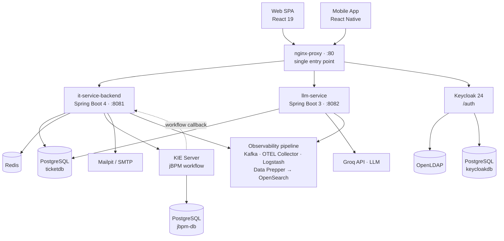

# 🎫 IT-Service Desk

**English** · [Türkçe](README.tr.md)

> A full-stack, multi-role **IT Service Management (ticketing) platform** — Keycloak-secured, jBPM-orchestrated, AI-assisted, and fully observable.


Customers report technical problems, support agents resolve them under **SLA** rules, and managers monitor the operation through **live dashboards**. The system is built as a containerised, polyglot monorepo that demonstrates a production-shaped full-stack architecture: identity federation, workflow orchestration, asynchronous processing, observability, and an AI summarisation service.

---

## 📑 Table of Contents

- [Key Features](#-key-features)
- [Architecture at a Glance](#-architecture-at-a-glance)
- [Technology Stack](#-technology-stack)
- [Getting Started](#-getting-started)
- [Local Development](#-local-development)
- [Project Structure](#-project-structure)
- [Testing & Quality](#-testing--quality)
- [Deployment](#-deployment)
- [Screenshots](#-screenshots)
- [Documentation](#-documentation)
- [Roadmap](#-roadmap)
- [License](#-license)

---

## ✨ Key Features

### Ticketing & Lifecycle
- Full ticket lifecycle as a state machine: `NEW → IN_PROGRESS → WAITING_FOR_CUSTOMER → RESOLVED → CLOSED`
- Each ticket runs as a **jBPM process instance** — status transitions are driven through the workflow engine
- **Claim/pool model** — agents pull tickets from a product-scoped pool; multiple agents can collaborate on one ticket
- Manual assignment with agent capacity checks, resolution notes, and a full **audit trail**

### SLA Management
- Per-priority SLA policies (`CRITICAL` / `HIGH` / `MEDIUM` / `LOW`) with configurable resolution and warning thresholds
- SLA clock **pauses** on `WAITING_FOR_CUSTOMER` and resumes on `IN_PROGRESS`
- A scheduler flags approaching and breached SLAs; the UI shows colour-coded countdown badges

### Communication & Files
- Chat-style ticket conversation with **internal** (agent-only) and **external** (customer-visible) comments
- Attachment upload with **content validation** — file type/size checks, keyword scan, and sensitive-data detection (tokens, private keys)
- Worklog time tracking per agent

### Notifications
- Multi-channel notifications (in-app feed + email simulation via Mailpit) for ticket, status, comment and SLA events
- Per-user notification preferences and **fully localised** notification content (rendered in the recipient's current language)

### AI Assistance
- Dedicated `llm-service` generates **AI ticket summaries** (Groq / Llama 3.1) in Turkish or English

### Dashboards & Reporting (Manager)
- KPI summary, status distribution, ticket timeline, priority-SLA breakdown, agent performance leaderboard, product metrics, CSAT analytics and SLA backlog alerts — all Caffeine-cached

### Security & Identity
- **Keycloak** SSO with users federated from **OpenLDAP**, OAuth2/OIDC, JWT, **2FA (TOTP)** and "remember me"
- Role-based access control: `CUSTOMER`, `AGENT`, `AGENT_ADMIN`, `MANAGER`
- Distributed **rate limiting** (Bucket4j + Redis), method-level authorization, internal service-to-service token auth

### Platform
- Web (React) **and** mobile (React Native / Expo) clients with functional parity
- Internationalisation (English / Turkish) and light/dark theming across the SPA **and** the Keycloak login screens
- End-to-end **observability**: structured logs, distributed traces and metrics in OpenSearch

---

## 🏗 Architecture at a Glance

All external traffic enters through a single **nginx** reverse proxy on port `80`.



> A detailed breakdown — container diagram, request flows, security model and design decisions — lives in **[docs/ARCHITECTURE.md](docs/ARCHITECTURE.md)**.

---

## 🛠 Technology Stack

| Layer | Technologies |
|-------|--------------|
| **Backend API** | Java 21, Spring Boot 4, Spring Security (OAuth2 Resource Server), Spring Data JPA, Flyway, WebSocket/STOMP, Caffeine, Bucket4j, Resilience4j |
| **AI Service** | Java 21, Spring Boot 3, Groq API (Llama 3.1) |
| **Web Frontend** | React 19, Vite, Tailwind CSS 4, React Router 7, i18next, keycloak-js, Recharts |
| **Mobile** | React Native, Expo |
| **Workflow** | jBPM / KIE Server 7.61, BPMN 2.0 |
| **Data** | PostgreSQL 15, Redis 7 |
| **Identity** | Keycloak 24, OpenLDAP |
| **Messaging / Logs** | Apache Kafka, Logstash |
| **Observability** | OpenTelemetry, OpenSearch + Dashboards, Data Prepper, Log4j2 |
| **Infrastructure** | Docker Compose, Kubernetes (kind + Kustomize), nginx |
| **Quality / CI** | JUnit 5, Mockito, Testcontainers, Vitest, JaCoCo, SonarQube, GitHub Actions |

---

## 🚀 Getting Started

### Prerequisites

- **Docker** & Docker Compose
- **Make** (the canonical command entry point — Windows-first; on POSIX run the underlying commands directly)
- For local (non-Docker) development: **JDK 21**, **Node.js 22+**
- A **Groq API key** ([console.groq.com/keys](https://console.groq.com/keys)) — only needed for the AI summary feature

### 1. Configure the environment

```bash
cp .env.example .env
```

Fill in the placeholder values in `.env` (database passwords, LDAP/Keycloak passwords, `GROQ_API_KEY`, etc.). Every variable is documented inline in `.env.example`.

### 2. Start the full stack

```bash
make up        # start everything in Docker
make ps        # list running containers
make logs s=it-service-backend   # tail one service
```

The first start pulls images, runs Flyway migrations and imports the Keycloak realm — give it a couple of minutes. Use `make rebuild` after changing application code, and `make down` to stop.

### 3. Access points

| Service | URL |
|---------|-----|
| **Web application** | http://localhost |
| API (Swagger UI) | http://localhost/api/swagger-ui.html |
| Keycloak | http://localhost/auth |
| Mailpit (captured e-mails) | http://localhost:8025 |
| OpenSearch Dashboards | http://localhost:5601 |
| phpLDAPadmin | http://localhost:8085 |
| KIE Server (jBPM) | http://localhost:8180/kie-server/docs |
| SonarQube (opt-in) | http://localhost:9000 |

### 4. Seed demo data

```bash
make gen       # build + run the data generator (products, tickets, history)
```

### 5. Demo users

Four users are seeded into OpenLDAP. Their **passwords are whatever you set** in `.env` (`LDAP_CUSTOMER_PASSWORD`, `LDAP_AGENT_PASSWORD`, `LDAP_MANAGER_PASSWORD`, `LDAP_AGENT_ADMIN_PASSWORD`).

| Role | Username | Lands on | Capabilities |
|------|----------|----------|--------------|
| Customer | `ctest` | My Tickets | Raise & track own tickets, comment, attach files, submit CSAT |
| Agent | `atest` | Workspace | Claim tickets, change status, worklog, internal notes, AI summary |
| Agent Admin | `aatest` | Workspace + Admin | All agent actions **+** user / product / SLA / rate-limit administration |
| Manager | `mtest` | Dashboard | Read-only dashboards, metrics and reports |

---

## 💻 Local Development

For hot-reload development, run the infrastructure in Docker and the apps on the host:

```bash
make infra         # start only infra containers (DB, Keycloak, Redis, jBPM, OpenSearch...)
make dev-backend   # run the backend on the host  (Spring Boot :8081)
make dev-frontend  # run the web frontend on the host (Vite :3000)
make dev-mobile    # start the Expo dev server for the mobile app
```

The Vite dev server proxies `/api` → `localhost:8081` and the WebSocket endpoint accordingly.

---

## 📂 Project Structure

```text
TicketSystemProject/
├── it-service-backend/      # Spring Boot 4 — main REST API (:8081)
├── llm-service/             # Spring Boot 3 — AI summarisation service (:8082)
├── it-service-frontend/     # React 19 + Vite — web SPA
├── it-service-mobile/       # React Native + Expo — mobile app
├── ticket-workflow-kjar/    # jBPM BPMN process definition (ticket-lifecycle)
├── data-generator/          # Standalone demo-data seeder
├── keycloak-init/           # Keycloak realm import
├── keycloak-themes/         # Custom Keycloak login theme
├── ldap-init/               # OpenLDAP bootstrap (seed users)
├── nginx/                   # Reverse proxy configuration
├── observability/           # OpenSearch dashboards / saved objects
├── data-prepper/            # Metrics pipeline configuration
├── k8s/                     # Kubernetes manifests (Kustomize base + overlays)
├── dev_plans/               # Design & planning documents
├── docs/                    # Architecture & technical documentation
├── docker-compose.yaml      # Full-stack orchestration
├── Makefile                 # Canonical command entry point
├── RUNBOOK.md               # Operations & incident playbooks
└── CLAUDE.md                # Codebase guide for AI assistants
```

---

## 🧪 Testing & Quality

```bash
make test            # backend unit tests + frontend tests
make verify          # backend unit + integration tests (Testcontainers) + JaCoCo report
make lint            # frontend ESLint
make ci              # full local CI gate: verify + frontend tests + lint
make sonar-up        # start SonarQube, then: make sonar
```

- **Backend** — JUnit 5 + Mockito unit tests; `*IT.java` integration tests run against a real PostgreSQL via **Testcontainers**. Coverage report: `it-service-backend/target/site/jacoco/index.html`.
- **Frontend** — Vitest + Testing Library (jsdom).
- **CI** — GitHub Actions runs backend `verify`, llm-service build, and frontend lint/test/build on every pull request.

---

## 📦 Deployment

| Path | Command | Notes |
|------|---------|-------|
| **Docker Compose** | `make up` / `make rebuild` | Single-host, the default development & demo path |
| **Kubernetes** | `make k8s-up` | kind cluster + Kustomize (`k8s/overlays/local`); a `prod` overlay adds HPA, cert-manager and SealedSecrets |
| **CI/CD** | GitHub Actions | CI on every PR; CD builds and pushes Docker Hub images on `main` |

See **[docs/ARCHITECTURE.md](docs/ARCHITECTURE.md)** for deployment topology and **[RUNBOOK.md](RUNBOOK.md)** for operational procedures.

---

## 📸 Screenshots

<!-- Add screenshots under docs/screenshots/ and embed them here. Suggested set: -->
<!-- - Login screen (with language/theme switch) -->
<!-- - Customer "My Tickets" view -->
<!-- - Ticket detail (conversation, SLA badge, AI summary) -->
<!-- - Agent workspace / ticket pool -->
<!-- - Manager dashboard -->
<!-- - OpenSearch observability dashboard -->

_Screenshots will be added here._

---

## 📚 Documentation

| Document | Purpose |
|----------|---------|
| **[docs/ARCHITECTURE.md](docs/ARCHITECTURE.md)** | System architecture, request flows, security model, design decisions |
| **[docs/API.md](docs/API.md)** | REST API reference — endpoints, parameters and example responses |
| **[docs/WORKFLOW.md](docs/WORKFLOW.md)** | jBPM / BPMN ticket-lifecycle workflow design |
| **[docs/CICD.md](docs/CICD.md)** | CI/CD pipeline design (GitHub Actions) |
| **[RUNBOOK.md](RUNBOOK.md)** | Operations & incident playbooks (DB backup, Keycloak re-import, Flyway repair...) |
| **API reference** | Interactive OpenAPI / Swagger UI at `http://localhost/api/swagger-ui.html` |
| **[CLAUDE.md](CLAUDE.md)** | Codebase conventions & guidance for AI coding assistants |

---

## 🗺 Roadmap

Potential next features — leveraging infrastructure that is already in place:

- **AI** — automatic ticket categorisation, agent reply suggestions, semantic duplicate detection
- **Real-time** — live agent ↔ customer chat, WebSocket-pushed notifications, mobile push
- **Productivity** — canned responses, ticket merge/link, bulk actions, tags
- **Automation** — rule engine / macros, round-robin assignment, approval workflows
- **Integrations** — inbound e-mail-to-ticket, Slack/Teams, outbound webhooks
- **Reporting** — CSAT surveys, scheduled report exports, public status page

---

## 📄 License

Built as an educational / portfolio full-stack project. Licensing terms to be defined.
