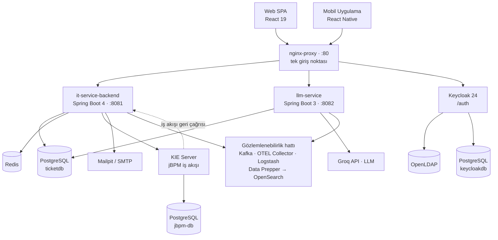

# 🎫 IT-Service Desk

**Türkçe** · [English](README.md)

> Tam yığın (full-stack), çok rollü bir **BT Hizmet Yönetimi (ticket) platformu** — Keycloak ile güvenli, jBPM ile orkestre edilen, yapay zekâ destekli ve uçtan uca gözlemlenebilir.


Müşteriler teknik sorunları bildirir, destek temsilcileri (agent) bunları **SLA** kuralları çerçevesinde çözer ve yöneticiler operasyonu **canlı panolar** üzerinden izler. Sistem; kimlik federasyonu, iş akışı orkestrasyonu, asenkron işleme, gözlemlenebilirlik ve bir yapay zekâ özetleme servisini bir araya getiren, üretime yakın yapıda tam yığın bir mimariyi sergileyen, konteynerleştirilmiş ve çok dilli (polyglot) bir monorepo olarak inşa edilmiştir.

---

## 📑 İçindekiler

- [Öne Çıkan Özellikler](#-öne-çıkan-özellikler)
- [Mimariye Genel Bakış](#-mimariye-genel-bakış)
- [Teknoloji Yığını](#-teknoloji-yığını)
- [Başlangıç](#-başlangıç)
- [Yerel Geliştirme](#-yerel-geliştirme)
- [Proje Yapısı](#-proje-yapısı)
- [Test ve Kalite](#-test-ve-kalite)
- [Dağıtım](#-dağıtım)
- [Ekran Görüntüleri](#-ekran-görüntüleri)
- [Dokümantasyon](#-dokümantasyon)
- [Lisans](#-lisans)

---

## ✨ Öne Çıkan Özellikler

### Ticket ve Yaşam Döngüsü
- Bir durum makinesi (state machine) olarak eksiksiz ticket yaşam döngüsü: `NEW → IN_PROGRESS → WAITING_FOR_CUSTOMER → RESOLVED → CLOSED`
- Her ticket bir **jBPM süreç örneği (process instance)** olarak çalışır — her durum geçişi iş akışı motoru üzerinden yürütülür; claim / unclaim / assign kaynaklı yan-etki geçişleri de dahil
- **Talep et / havuz modeli** — temsilciler, ürün kapsamlı bir havuzdan ticket çeker; birden fazla temsilci tek bir ticket üzerinde birlikte çalışabilir
- Temsilci kapasite kontrolleriyle manuel atama, çözüm notları ve eksiksiz bir **denetim izi (audit trail)**

### SLA Yönetimi
- Yapılandırılabilir çözüm ve uyarı eşikleriyle önceliğe göre SLA politikaları (`CRITICAL` / `HIGH` / `MEDIUM` / `LOW`)
- SLA sayacı, ticket `WAITING_FOR_CUSTOMER` veya `RESOLVED` durumundayken **duraklar**, `IN_PROGRESS`'e dönünce duraklatmada geçen süre korunarak (yalnızca aktif süre işler) kaldığı yerden devam eder ve ticket `CLOSED` olduğunda tamamen durur
- Bir zamanlayıcı, yaklaşan ve ihlal edilen SLA'ları işaretler; arayüz renk kodlu geri sayım rozetleri gösterir

### İletişim ve Dosyalar
- **Dahili** (yalnızca temsilciye görünür) ve **harici** (müşteriye görünür) yorumlarla sohbet tarzı ticket görüşmesi
- **İçerik doğrulamalı** ek dosya yükleme — dosya türü/boyutu denetimleri, anahtar kelime taraması ve hassas veri tespiti (token'lar, özel anahtarlar)
- Temsilci başına çalışma kaydı (worklog) ile süre takibi

### Bildirimler
- Ticket, durum, yorum ve SLA olayları için çok kanallı bildirimler (uygulama içi akış + Mailpit aracılığıyla e-posta simülasyonu)
- Kullanıcı başına bildirim tercihleri ve **tamamen yerelleştirilmiş** bildirim içeriği (alıcının o anki dilinde oluşturulur)

### Yapay Zekâ Desteği
- Özel `llm-service`, Türkçe veya İngilizce **yapay zekâ destekli ticket özetleri** üretir (Groq / Llama 3.1)

### Panolar ve Raporlama (Yönetici)
- KPI özeti, durum dağılımı, ticket zaman çizelgesi, öncelik-SLA kırılımı, temsilci performans sıralaması, ürün metrikleri, CSAT analitiği ve SLA birikim (backlog) uyarıları — tümü Caffeine ile önbelleğe alınmış

### Güvenlik ve Kimlik
- **OpenLDAP**'tan federe edilen kullanıcılarla **Keycloak** SSO, OAuth2/OIDC, JWT, **2FA (TOTP)** ve "beni hatırla"
- Rol tabanlı erişim denetimi: `CUSTOMER`, `AGENT`, `AGENT_ADMIN`, `MANAGER`
- Dağıtık **hız sınırlama (rate limiting)** (Bucket4j + Redis), metot düzeyinde yetkilendirme, servisten servise dahili token kimlik doğrulaması

### Platform
- İşlevsel paritede web (React) **ve** mobil (React Native / Expo) istemciler
- SPA **ve** Keycloak giriş ekranları genelinde uluslararasılaştırma (İngilizce / Türkçe) ve açık/koyu tema
- Uçtan uca **gözlemlenebilirlik**: OpenSearch içinde yapılandırılmış günlükler, dağıtık izler (trace) ve metrikler

---

## 🏗 Mimariye Genel Bakış

Tüm dış trafik, `80` numaralı port üzerindeki tek bir **nginx** ters proxy'si üzerinden girer.



> Ayrıntılı bir döküm — konteyner diyagramı, istek akışları, güvenlik modeli ve tasarım kararları — **[docs/ARCHITECTURE.tr.md](docs/ARCHITECTURE.tr.md)** dosyasında yer alır.

---

## 🛠 Teknoloji Yığını

| Katman | Teknolojiler |
|-------|--------------|
| **Backend API** | Java 21, Spring Boot 4, Spring Security (OAuth2 Resource Server), Spring Data JPA, Flyway, WebSocket/STOMP, Caffeine, Bucket4j, Resilience4j |
| **Yapay Zekâ Servisi** | Java 21, Spring Boot 3, Groq API (Llama 3.1) |
| **Web Frontend** | React 19, Vite, Tailwind CSS 4, React Router 7, i18next, keycloak-js, Recharts |
| **Mobil** | React Native, Expo |
| **İş Akışı** | jBPM / KIE Server 7.61, BPMN 2.0 |
| **Veri** | PostgreSQL 15, Redis 7 |
| **Kimlik** | Keycloak 24, OpenLDAP |
| **Mesajlaşma / Günlükler** | Apache Kafka, Logstash |
| **Gözlemlenebilirlik** | OpenTelemetry, OpenSearch + Dashboards, Data Prepper, Log4j2 |
| **Altyapı** | Docker Compose, Kubernetes (kind + Kustomize), nginx |
| **Kalite / CI** | JUnit 5, Mockito, Testcontainers, Vitest, JaCoCo, SonarQube, GitHub Actions |

---

## 🚀 Başlangıç

### Ön Koşullar

- **Docker** ve Docker Compose
- **Make**
  - **Windows:** [GnuWin32 Make](http://gnuwin32.sourceforge.net/packages/make.htm) ile veya `choco install make` ile kurun. Makefile, Windows-uyumlu komutlar (`mvnw.cmd`, `cmd /k`, `rmdir`) kullanır.
  - **macOS / Linux:** Sistemde gelir; gerekirse `brew install make` / `apt install make`. Manuel çağırdığınız target'larda `mvnw.cmd` yerine `./mvnw` kullanın.
- Yerel (Docker'sız) geliştirme için: **JDK 21**, **Node.js 22+**
- Bir **Groq API anahtarı** ([console.groq.com/keys](https://console.groq.com/keys)) — yalnızca yapay zekâ özet özelliği için gereklidir

### 1. Ortamı yapılandırın

```bash
cp .env.example .env
```

`.env` dosyasındaki yer tutucu değerleri doldurun (veritabanı parolaları, LDAP/Keycloak parolaları, `GROQ_API_KEY` vb.). Her değişken, `.env.example` içinde satır içinde belgelenmiştir.

### 2. Tüm yığını başlatın

```bash
make up        # her şeyi Docker'da başlatır
make ps        # çalışan konteynerleri listeler
make logs s=it-service-backend   # tek bir servisin günlüklerini izler
```

İlk başlatma; imajları çeker, Flyway migrasyonlarını çalıştırır ve Keycloak realm'ini içe aktarır — birkaç dakika tanıyın. Uygulama kodunu değiştirdikten sonra `make rebuild`, durdurmak için `make down` kullanın.

### 3. Keycloak kurulumunu tamamlayın (ilk `make up` sonrası bir defalık)

Realm export'u maskelenmiş gizli değerlerle (`**********`) gelir. İlk başlatmada bunları elle ayarlamanız gerekir:

#### 3a. LDAP bind şifresini girin
1. http://localhost/auth → **Administration Console** → `admin` kullanıcısı ile `.env`'deki `KEYCLOAK_ADMIN_PASSWORD` ile giriş yapın.
2. Sol üst menüden realm'i **TicketSystemRealm**'e değiştirin.
3. **User Federation → ldap → Bind credentials**: `.env`'deki `LDAP_ADMIN_PASSWORD` değerini yapıştırın.
4. **Test connection** ve **Test authentication** — ikisi de başarılı olmalı.
5. **Save** edin, sonra **Action → Sync all users** ile LDAP kullanıcılarını Keycloak'a aktarın.

#### 3b. Service-account client secret'ı yeniden üretin
1. **Clients → ticket-client → Credentials → Regenerate**.
2. Yeni secret'ı kopyalayın ve `.env` içinde `KEYCLOAK_ADMIN_CLIENT_SECRET=<yapıştır>` olarak ayarlayın.
3. Backend'i yeniden başlatın ki yeni değeri okusun:
   ```bash
   make restart s=it-service-backend
   ```

#### 3c. Tohum kullanıcılarına realm rollerini atayın
LDAP'tan senkronize edilen kullanıcılar realm rolü olmadan gelir. Her kullanıcı için **Users → kullanıcı adı → Role mapping → Assign role** üzerinden şu eşlemeyi yapın:

| Kullanıcı | Realm rolü |
|-----------|------------|
| `ctest`   | `customer` |
| `atest`   | `agent` |
| `aatest`  | `agent_admin` |
| `mtest`   | `manager` |

Artık http://localhost adresinden giriş yapabilirsiniz.

### 4. Erişim noktaları

| Servis | URL |
|---------|-----|
| **Web uygulaması** | http://localhost |
| API (Swagger UI) | http://localhost/swagger-ui/index.html |
| Keycloak | http://localhost/auth |
| Keycloak Admin Console | http://localhost/auth/admin — giriş: `admin` / `KEYCLOAK_ADMIN_PASSWORD` (`.env`'den) |
| Mailpit (yakalanan e-postalar) | http://localhost:8025 |
| OpenSearch Dashboards | http://localhost:5601 |
| phpLDAPadmin | http://localhost:8085 — giriş: `cn=admin,dc=ticketsystem,dc=com` / `LDAP_ADMIN_PASSWORD` |
| KIE Server (jBPM iş akışı API'si) | http://localhost:8180/kie-server/docs |
| SonarQube (isteğe bağlı) | http://localhost:9000 |

### 5. Demo verilerini oluşturun

```bash
make gen       # veri üreticisini derler + çalıştırır (ürünler, ticket'lar, geçmiş)
```

### 6. Demo kullanıcıları

OpenLDAP'a dört kullanıcı eklenir. **Parolaları, `.env` içinde belirlediğiniz değerlerdir** (`LDAP_CUSTOMER_PASSWORD`, `LDAP_AGENT_PASSWORD`, `LDAP_MANAGER_PASSWORD`, `LDAP_AGENT_ADMIN_PASSWORD`).

| Rol | Kullanıcı Adı | Açılış Sayfası | Yetenekler |
|------|----------|----------|--------------|
| Müşteri | `ctest` | Ticket'larım | Kendi ticket'larını oluşturma ve izleme, yorum, dosya ekleme, CSAT gönderme |
| Temsilci | `atest` | Çalışma Alanı | Ticket talep etme, durum değiştirme, çalışma kaydı, dahili notlar, yapay zekâ özeti |
| Temsilci Yöneticisi | `aatest` | Çalışma Alanı + Yönetim | Tüm temsilci işlemleri **+** kullanıcı / ürün / SLA / hız sınırı yönetimi |
| Yönetici | `mtest` | Pano | Salt okunur panolar, metrikler ve raporlar |

---

## 💻 Yerel Geliştirme

Anında yenilemeli (hot-reload) geliştirme için altyapıyı Docker'da, uygulamaları ise ana makinede (host) çalıştırın:

```bash
make infra         # yalnızca altyapı konteynerlerini başlatır (DB, Keycloak, Redis, jBPM, OpenSearch...)
make dev-backend   # backend'i ana makinede çalıştırır  (Spring Boot :8081)
make dev-frontend  # web frontend'i ana makinede çalıştırır (Vite :3000)
make dev-mobile    # mobil uygulama için Expo geliştirme sunucusunu başlatır
```

Vite geliştirme sunucusu `/api/v1` isteklerini `localhost:8081` adresine, WebSocket uç noktasını da buna uygun şekilde proxy'ler.

---

## 📂 Proje Yapısı

```text
TicketSystemProject/
├── it-service-backend/      # Spring Boot 4 — ana REST API (:8081)
├── llm-service/             # Spring Boot 3 — yapay zekâ özetleme servisi (:8082)
├── it-service-frontend/     # React 19 + Vite — web SPA
├── it-service-mobile/       # React Native + Expo — mobil uygulama
├── ticket-workflow-kjar/    # jBPM BPMN süreç tanımı (ticket-lifecycle)
├── data-generator/          # Bağımsız demo veri üreticisi
├── keycloak-init/           # Keycloak realm içe aktarımı
├── keycloak-themes/         # Özel Keycloak giriş teması
├── ldap-init/               # OpenLDAP bootstrap (başlangıç kullanıcıları)
├── nginx/                   # Ters proxy yapılandırması
├── observability/           # OpenSearch panoları / kayıtlı nesneler
├── data-prepper/            # Metrik hattı yapılandırması
├── k8s/                     # Kubernetes manifestoları (Kustomize base + overlays)
├── dev_plans/               # Tasarım ve planlama dokümanları
├── docs/                    # Mimari ve teknik dokümantasyon
├── docker-compose.yaml      # Tam yığın orkestrasyonu
├── Makefile                 # Kanonik komut giriş noktası
└── RUNBOOK.md               # Operasyon ve olay müdahale kılavuzları
```

---

## 🧪 Test ve Kalite

```bash
make test            # backend birim testleri + frontend testleri
make verify          # backend birim + entegrasyon testleri (Testcontainers) + JaCoCo raporu
make lint            # frontend ESLint
make ci              # tam yerel CI kapısı: verify + frontend testleri + lint
make sonar-up        # SonarQube'u başlatır, ardından: make sonar
```

- **Backend** — JUnit 5 + Mockito birim testleri; `*IT.java` entegrasyon testleri **Testcontainers** aracılığıyla gerçek bir PostgreSQL'e karşı çalışır. Kapsam raporu: `it-service-backend/target/site/jacoco/index.html`.
- **Frontend** — Vitest + Testing Library (jsdom).
- **CI** — GitHub Actions her pull request'te backend `verify`, llm-service derlemesi ve frontend lint/test/build adımlarını çalıştırır.

---

## 📦 Dağıtım

| Yol | Komut | Notlar |
|------|---------|-------|
| **Docker Compose** | `make up` / `make rebuild` | Tek ana makine, varsayılan geliştirme ve demo yolu |
| **Kubernetes** | `make k8s-up` | kind kümesi + Kustomize (`k8s/overlays/local`); `prod` overlay'i HPA, cert-manager ve SealedSecrets ekler |
| **CI/CD** | GitHub Actions | Her PR'da CI; `main` üzerinde CD, Docker Hub imajlarını derleyip yayınlar |

Dağıtım topolojisi için **[docs/ARCHITECTURE.tr.md](docs/ARCHITECTURE.tr.md)** dosyasına, operasyonel prosedürler için **[RUNBOOK.md](RUNBOOK.md)** dosyasına bakın.

---

## 📸 Ekran Görüntüleri

### Kimlik Doğrulama


*Giriş — dil ve açık/koyu tema değiştirici.*


*Girişte TOTP 2FA istemi.*


*Şifre sıfırlama — e-posta ile sıfırlama bağlantısı isteme.*

### Müşteri


*Ticket'larım → **Aktif** sekmesi — CLOSED olmayan biletler, status filtresi aktif statülerle sınırlı.*


*Ticket'larım → **Kapalı** sekmesi — yalnız CLOSED biletler, status filtresi gizli.*


*Ticket oluşturma modalı — ürün, konu ve öncelik seçimi.*


*Ticket detayı — görüşme akışı, SLA geri sayım rozeti ve ek dosyalar.*


*Çözüm (RESOLVED) sonrası CSAT anketi — 1-5 puan + yorum.*

### Temsilci / Temsilci Yöneticisi


*Çalışma Alanı — temsilcinin sahiplendiği biletler.*


*Havuz — sahiplenilmemiş, alınmaya hazır biletler.*


*Takım — Temsilci Yöneticisinin tüm ajanların kuyruğunu izlediği görünüm.*


*Temsilci tarafında ticket detayı — internal note sekmesi ve worklog paneli.*


*AI özet modalı — Groq tarafından üretilen ticket özeti.*


*Temsilci Yöneticisi paneli — kullanıcı / ürün / SLA / rate-limit yönetimine giriş.*


*Kullanıcı yönetimi — Keycloak rolleri, agent kapasitesi ve ürün yetkileri.*


*Ürün & konu konfigürasyonu — müşterilerin bilet açabileceği kategorilerin CRUD'u.*


*Sıkça karşılaşılan sorunlar editörü — her ürün/konuya bağlı bilgi tabanı.*

### Yönetici


*Dashboard — KPI kartları: açık biletler, SLA ihlali, ortalama yanıt süresi, CSAT.*


*Status dağılımı ve ticket timeline grafikleri.*


*Ajan performans tablosu — iş yükü, çözüm hızı, CSAT ve SLA istatistikleri.*

### Hesap & Bildirimler


*Profil — dil / tema tercihi, şifre değişikliği ve 2FA yönetimi.*


*Uygulama içi bildirim akışı (zil ikonu) — STOMP canlı güncellemeleri, okunmamış sayacı.*


*Olay bazlı bildirim tercihleri — hangi olayların e-posta tetikleyeceğini seç.*


*Mailpit'te (geliştirme SMTP yakalayıcısı) yakalanmış ticket / SLA e-postası.*

---

## 📚 Dokümantasyon

| Doküman | Amaç |
|----------|---------|
| **[docs/ARCHITECTURE.tr.md](docs/ARCHITECTURE.tr.md)** | Sistem mimarisi, istek akışları, güvenlik modeli, tasarım kararları |
| **[docs/API.md](docs/API.md)** | REST API referansı — uç noktalar, parametreler ve örnek yanıtlar |
| **[docs/WORKFLOW.md](docs/WORKFLOW.md)** | jBPM / BPMN ticket yaşam döngüsü iş akışı tasarımı |
| **[docs/CICD.md](docs/CICD.md)** | CI/CD hattı tasarımı (GitHub Actions) |
| **[RUNBOOK.md](RUNBOOK.md)** | Operasyon ve olay müdahale kılavuzları (DB yedeği, Keycloak yeniden içe aktarımı, Flyway onarımı...) |
| **API referansı** | `http://localhost/swagger-ui/index.html` adresinde etkileşimli OpenAPI / Swagger UI |

---

## 📄 Lisans

© 2026 Ukbe Taha ŞAHİNKAYA. Tüm hakları saklıdır.

Bu proje bir **eğitim ve portföy projesi** olarak geliştirilmiştir. Yalnızca **değerlendirme ve öğrenme amacıyla** paylaşılmaktadır. Yazarın önceden yazılı izni olmadan; tamamen veya kısmen, herhangi bir **ticari veya kâr amaçlı** kullanım, kopyalama, değiştirme, dağıtım ya da çalıştırma **yapılamaz**.

Tam koşullar için [LICENSE](LICENSE) dosyasına bakın.
