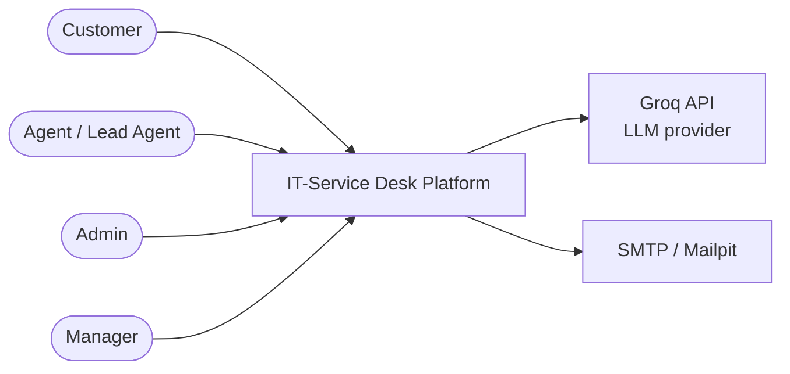
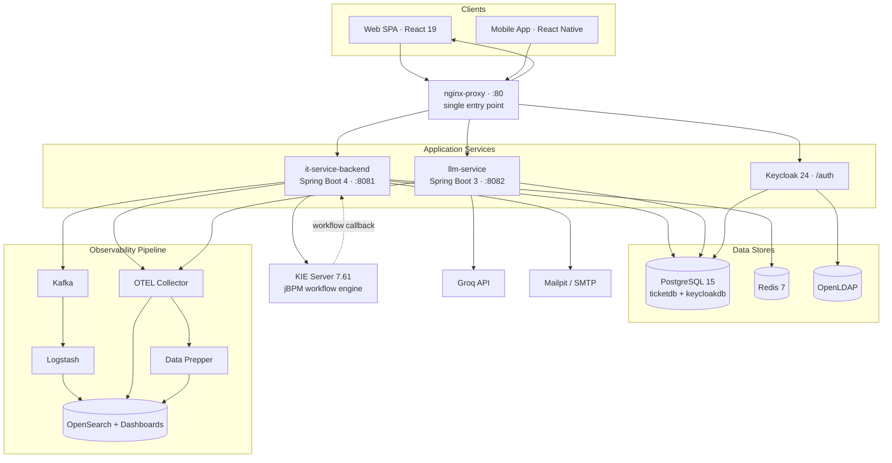
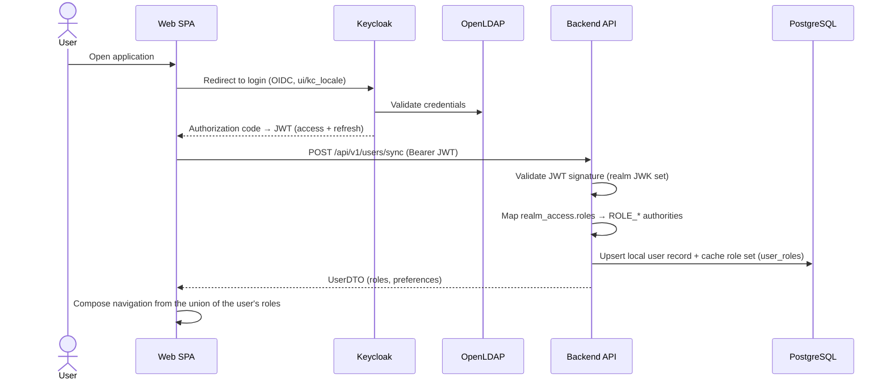
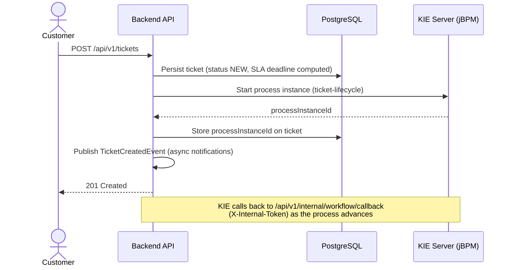
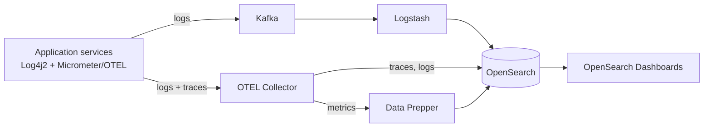
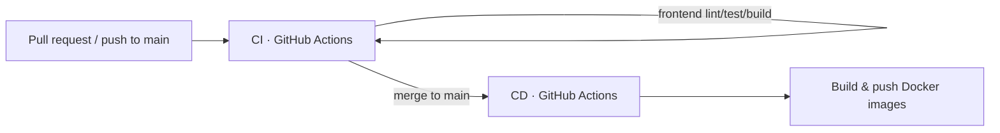

# Architecture

**English** · [Türkçe](ARCHITECTURE.tr.md)

Technical architecture of the **IT-Service Desk** platform — a multi-role IT Service Management (ticketing) system. This document covers the system structure, the main runtime flows, the security model, and the key design decisions behind them.

For setup and commands see the [README](../README.md); for operational procedures see the [RUNBOOK](../RUNBOOK.md).

---

## 1. Overview

The platform lets **customers** raise support tickets, **agents** resolve them under SLA rules, and **managers** monitor the operation through dashboards. It is delivered as a **containerised, polyglot monorepo** in which every concern — API, AI, identity, workflow, data, messaging, observability — runs as an independent, separately deployable service.

The design goals are: clear separation of concerns, stateless and horizontally scalable application services, externalised configuration, and end-to-end observability.

---

## 2. Architectural Style

| Aspect | Approach |
|--------|----------|
| **Topology** | Microservice-leaning: discrete containers behind a single reverse proxy |
| **Backend** | Classic layered architecture (Controller → Service → Repository) |
| **Frontend** | Single-Page Application (React) + a React Native mobile client |
| **Communication** | Synchronous REST (JSON) between clients and services; STOMP/WebSocket for live updates; HTTP callbacks from the workflow engine |
| **Identity** | Externalised to Keycloak — applications never store passwords |
| **State** | Application services are **stateless** (JWT-based, no server session); all state lives in PostgreSQL / Redis |
| **Configuration** | 12-factor: environment variables, Spring profiles, `application.yml` |
| **Schema management** | Versioned database migrations (Flyway); Hibernate runs in `validate` mode |

---

## 3. System Context



The platform integrates with two external dependencies: the **Groq API** for AI summarisation and an **SMTP server** (Mailpit in development) for outbound e-mail.

Staff roles are **additive** — a user holds a *set* of roles and their effective permissions are the union. The five roles span three axes: **operational** (`agent` claims and works tickets; `lead_agent`, a Keycloak composite of `agent`, additionally assigns, acts without claiming and manages product content), **configuration** (`admin` — global system setup), and **oversight** (`manager` — global, read-only dashboards and reporting). `customer` is the end user and is a **singleton role**: it is mutually exclusive with every staff role (a customer can never also be agent/lead_agent/admin/manager), and the backend rejects any combination that mixes it with another role. A "super-admin" account is simply a user that holds all of `admin` + `lead_agent` + `manager` (e.g. the `superadmin` seed user) — there is no dedicated super-admin role.

---

## 4. Container Diagram

All external traffic enters through **nginx** on port `80`. No application service or data store is exposed directly in a production-shaped deployment.



### Routing (nginx)

| Path | Target |
|------|--------|
| `/` | `it-service-frontend` (static SPA) |
| `/api/v1/` | `it-service-backend:8081` |
| `/api/v1/ai/` | `llm-service:8082` |
| `/auth/` | `keycloak-iam:8080` |

---

## 5. Components & Responsibilities

| Component | Stack | Responsibility |
|-----------|-------|----------------|
| **it-service-backend** | Spring Boot 4 / Java 21 | Core REST API — tickets, SLA, users, comments, attachments, notifications, dashboards. Owns the `ticketdb` schema. |
| **llm-service** | Spring Boot 3 / Java 21 | AI ticket summarisation via the Groq API. Shares `ticketdb` with an isolated Flyway history table. |
| **it-service-frontend** | React 19 + Vite | Web SPA — role-scoped UIs; navigation is composed from the **union** of the user's roles (customer, agent, lead_agent, admin, manager). The React Native mobile client mirrors the same composition. |
| **it-service-mobile** | React Native + Expo | Mobile client with functional parity to the web app. |
| **ticket-workflow-kjar** | jBPM / BPMN 2.0 | The `ticket-lifecycle` process definition, baked into the KIE Server image and registered via `kjar-deploy` on startup. |
| **Keycloak** | Keycloak 24 | Identity provider — OAuth2/OIDC, realm `TicketSystemRealm`, users federated from LDAP. |
| **OpenLDAP** | OpenLDAP | Directory server — the source of truth for user accounts. |
| **KIE Server** | jBPM 7.61 (WildFly) | Hosts the workflow process; persists its process/history state to a file-based H2 store on a mounted volume. |
| **PostgreSQL** | PostgreSQL 15 | `ticketdb` (application) and `keycloakdb` (Keycloak). |
| **Redis** | Redis 7 | Distributed rate-limit buckets; staging ground for future cache/queue use. |
| **Kafka + Logstash** | Kafka 3.7 | Log transport buffer and consumer into OpenSearch. |
| **OTEL Collector + Data Prepper** | OpenTelemetry | Telemetry ingestion; fans traces/logs/metrics out to OpenSearch. |
| **OpenSearch** | OpenSearch 3.6 | Unified store for logs, traces and metrics, with Dashboards for exploration. |
| **nginx** | nginx | Reverse proxy and single ingress point. |
| **data-generator** | Java | Standalone tool that seeds realistic demo data through the API. |

---

## 6. Backend Internal Structure

The backend follows a conventional Spring layered architecture under `com.ticketsystem.it_service_backend`:

```
controller/   REST endpoints under /api/v1/** — validation, HTTP mapping
service/      Business logic (TicketService, SlaPolicyService, WorkflowService,
              NotificationService, EmailService, MetricsService, KeycloakAdminService...)
repository/   Spring Data JPA repositories
entity/       JPA entities (Hibernate, ddl-auto = validate)
dto/          Request/response models — entities never cross the API boundary
event/        @EventListener / @Async domain-event handlers
scheduler/    Cron-driven tasks (SLA monitoring, notifications)
filter/       Rate-limit filter
interceptor/  Request logging
websocket/    STOMP configuration for live updates
config/       Security, cache, Redis, localization, OpenAPI configuration
exception/    Global exception handler → standard API error format
```

Cross-cutting behaviour is centralised: a `GlobalExceptionHandler` produces a consistent error envelope, Bean Validation messages are localised, and method-level security (`@PreAuthorize`) enforces authorization close to the business logic.

---

## 7. Key Runtime Flows

### 7.1 Authentication & Authorization



The backend is a pure **OAuth2 Resource Server**: stateless, JWT-only, signature verified against the Keycloak realm's JWK set. There is no server-side session.

### 7.2 Ticket Creation (with workflow orchestration)



If KIE Server is unavailable the call is wrapped in a **circuit breaker** — the ticket is still created and the `processInstanceId` is reconciled later, so the workflow engine never blocks the core API.

### 7.3 SLA Monitoring

The SLA deadline is computed at ticket creation from the per-priority policy. A **scheduler** runs periodically and:

- marks tickets whose deadline has passed as **breached** and notifies agents + managers;
- flags tickets approaching their warning threshold and notifies the assigned agents.

The SLA clock **pauses** while a ticket is `WAITING_FOR_CUSTOMER` or `RESOLVED` and resumes on return to `IN_PROGRESS`, so customer-side delays and time spent awaiting confirmation do not count against the support team. Time spent paused genuinely does not count against the deadline: `slaElapsedMs` accumulates only **active** (counting) time, and on resume `slaDeadline` is projected forward by the remaining active budget (`getSlaDurationMs(priority) − slaElapsedMs`), so neither the active badge nor the breach scheduler lose the paused interval. Once a ticket is `CLOSED` the SLA is finalised and the clock stops permanently. Pause/resume is mirrored into the jBPM process via signals.

### 7.4 AI Summary

The frontend calls `llm-service` (via `/api/v1/ai/`). The service collects the ticket, its comments, worklogs, resolution note and audit history, builds a language-specific prompt, calls the Groq API, and persists the summary. A dedicated per-IP rate limit protects this comparatively expensive endpoint.

### 7.5 Dashboards & Metrics

`MetricsService` serves role-scoped dashboards from Caffeine-cached aggregations:

- **Personal dashboards** — every user has a self-only view: a customer **Overview** (scoped by `customer_id`) and an agent **My Performance** view (scoped by claim), served from `/api/v1/metrics/me/customer` and `/me/agent`.
- **Per-product dashboards** — a product-scoped view (status / priority / timeline / SLA / CSAT plus a product-scoped agent leaderboard) at `/products/{productId}/dashboard`, reachable from the Products panel; global for admin/manager, product-scoped for lead_agent.
- **Oversight drill-down** — admin / manager / lead can open any user's agent or customer dashboard (`/users/{userId}/agent`, `/users/{userId}/customer`); admin/manager are global, lead_agent is product-scoped.
- **Date-range scoped KPIs** — dashboard KPIs follow the selected date range (no fixed 7-day window). SLA compliance and average resolution are computed over **all tickets resolved within the period**, not only those currently in the `RESOLVED` state.
- **Charts & alerts** — CSAT distribution/trend and daily-worklog charts, plus **configurable stuck-ticket alerts** (waiting/resolved) timed from state entry, surfaced in a collapsed-by-default banner with clickable rows.

---

## 8. Security Model

| Concern | Implementation |
|---------|----------------|
| **Authentication** | Keycloak (OAuth2/OIDC); JWT (RS256) verified by the resource server |
| **User federation** | OpenLDAP — Keycloak's user storage; LDAP groups map to realm roles |
| **2FA** | TOTP (authenticator app) configurable per user |
| **Password reset** | Delegated to Keycloak's native forgot-password flow (e-mailed reset link); the application hosts no custom reset pages |
| **Authorization — user endpoints** | `realm_access.roles` → `ROLE_*` authorities; method-level `@PreAuthorize` (+ `util/AuthRoles` helpers for service-layer scope/claim checks) |
| **Authorization — internal endpoints** | `/api/v1/internal/**` bypass JWT; gated by a shared `X-Internal-Token` header (used only by the KIE Server callback) |
| **Roles** | **Additive multi-role** for staff (effective permissions = union of the held set): `agent` (claims & works tickets), `lead_agent` (composite of `agent`; assign, act without claiming, manage product content, team dashboard), `admin` (global system config), `manager` (global read-only oversight). `customer` (end user) is a **singleton** role — mutually exclusive with every staff role; the backend rejects mixing it with any other role. Stored in Keycloak, cached in `user_roles` (Flyway V37), synced on `/users/sync`. A super-admin is a user holding all of `admin` + `lead_agent` + `manager`. |
| **Session** | Stateless (`SessionCreationPolicy.STATELESS`); CSRF disabled (no cookies) |
| **Anonymous allow-list** | Auth endpoints, WebSocket handshake, Swagger UI, `/actuator/health\|info\|metrics` |
| **Rate limiting** | Bucket4j token-bucket, distributed via Redis; configured via `application.yml` (`app.rate-limit.global-api.*`) and `RATE_LIMIT_GLOBAL_*` env vars |
| **Input safety** | Bean Validation on all DTOs; attachment type/size checks and sensitive-data scanning; native-query sort columns are resolved against a **whitelist** before interpolation into `ORDER BY` (no raw request value reaches the SQL) |
| **Data isolation** | Customers can only access their own tickets; agents act only on claimed tickets; agent / lead_agent are scoped to their authorised products; `admin` and `manager` are global. User-lookup endpoints are access-controlled — the agent roster is staff-only and individual user reads are restricted to self-or-privileged |

---

## 9. Data Architecture

- A single PostgreSQL instance hosts **`ticketdb`** (application data) and **`keycloakdb`** (Keycloak). The jBPM engine keeps its state in a **separate file-based H2 store** (not in PostgreSQL) — the two must not be conflated.
- Schema changes go exclusively through **Flyway migrations** (`V<n>__*.sql`, currently V1–V47). Hibernate runs as `ddl-auto: validate` — it never alters the schema.
- `llm-service` shares `ticketdb` but keeps an **isolated Flyway history table** (`flyway_schema_history_llm`, baselined from 0) so its migrations coexist with the backend's without collision.
- DTOs form the API boundary; JPA entities are never serialised directly to clients.
- The jBPM engine **no longer uses a separate PostgreSQL instance** — its process/history state lives in a file-based H2 store persisted on a mounted volume, so the two databases are independent without a second Postgres container.

Core tables include `tickets`, `users` (including the `onboarding_completed` flag, Flyway V46), `user_roles` (the cached additive role set, Flyway V37), `products`, `ticket_comments`, `ticket_worklogs`, `attachments`, `resolution_notes`, `csat`, `notifications`, `notification_preferences`, `sla_policies`, `ticket_claims`, `agent_product_limits`, `ticket_audit_logs`, `access_requests` and `known_issues`.

---

## 10. Workflow Integration (jBPM)

Every ticket is backed by a jBPM **process instance** of `com.ticketsystem.workflow.ticket-lifecycle`. The kjar is **baked into the KIE Server image** at build time and registered as the `ticket-workflow` container through the controller (`kjar-deploy`) on startup, so a fresh deployment has the workflow ready without a separate deploy step. The container runs with the **`PER_PROCESS_INSTANCE`** runtime strategy (a dedicated ksession per instance) so concurrent/orphaned process activity does not contend on a single shared session.

- **Status transitions are command-based:** the ticket API exposes guarded action endpoints (`/wait`, `/resume`, `/resolve`, `/reopen`, `/close`) rather than a single generic `/status` endpoint. Each action drives the status within its own guard — idempotent if already at the target, `400` if the source state is incompatible. `NEW ↔ IN_PROGRESS` is reached through claim / unclaim only, preserving the claim ↔ status invariant.
- **Backend → KIE:** `WorkflowService` / `KieServerAdapter` use the KIE Server REST client to start processes, sync status and assignment, and send SLA pause/resume and close signals. The BPMN is the **authoritative state machine for every status change** — status/assignment sync drives it by sending the matching `transition_<STATUS>` signal (writing the `status` process variable alone does not move the process token). This covers not only the explicit action transitions but also the side-effect transitions caused by claim / unclaim / assign (e.g. a claim auto-promoting NEW → IN_PROGRESS), keeping the BPMN and the DB consistent.
- **KIE → Backend:** the process calls back to `/api/v1/internal/workflow/callback`, authenticated by the static `X-Internal-Token` header. Only the base callback URL is passed as a process variable; the BPMN script task reads the token from the KIE Server environment at call time, so the secret never lands in the process store or logs.
- **Process state persistence:** the KIE Server persists its process/history state to a **file-based H2 store on a mounted volume** (no separate `jbpm-db` PostgreSQL instance) — so process instances survive container restarts.
- **Resilience:** all KIE calls are wrapped in a Resilience4j **circuit breaker** — workflow outages degrade gracefully and never block the ticket API. A *stale* `processInstanceId` (the BPMN instance is gone — e.g. KIE returns **404 "process instance not found"** because the history store was reset while the ticket survived in `ticketdb`) is treated as a deterministic, per-instance outcome rather than a health signal: it is **ignored by the circuit breaker** (so one missing instance never trips it for every other ticket) and the backend simply **accepts the DB-side transition** instead of blocking the ticket.

---

## 11. Observability

The platform emits **logs, traces and metrics**, all converging on OpenSearch.



- **Logs** — Log4j2 emits structured JSON; shipped both through Kafka → Logstash and through the OpenTelemetry log appender.
- **Traces** — Micrometer Tracing bridges to OpenTelemetry; exported via OTLP and sampled (1.0 in development).
- **Metrics** — exported with **delta temporality** and routed through Data Prepper, because the collector's OpenSearch exporter does not handle metrics. Delta temporality lets OpenSearch `sum` aggregations work without Prometheus-style `rate()`.
- **Dashboards** — a combined "Ticket System Observability" dashboard (metrics + traces + logs) ships as saved objects in `observability/`.

---

## 12. Asynchronous Processing & Scheduling

The backend enables `@EnableAsync` and `@EnableScheduling`:

- **Domain events** — actions such as ticket creation publish events handled asynchronously (`@EventListener` + `@Async`), keeping notification and e-mail work off the request thread. `@Async` runs on a **bounded `ThreadPoolTaskExecutor`** (core 4 / max 16 / queue 500, `CallerRunsPolicy`) so bursts of event activity apply backpressure rather than exhausting threads.
- **Scheduled tasks** — cron-driven jobs handle SLA monitoring and notification housekeeping (e.g. purging expired notifications).
- **Live updates** — STOMP/WebSocket pushes ticket-detail events to connected clients.

---

## 13. Resilience & Performance

| Mechanism | Purpose |
|-----------|---------|
| **Circuit breaker** (Resilience4j) | Isolates jBPM/KIE Server failures from the core API |
| **Caching** (Caffeine) | Dashboard aggregations cached with a 5-minute TTL; evicted on relevant writes |
| **Rate limiting** (Bucket4j + Redis) | Protects the API globally and throttles expensive AI calls |
| **Connection pooling** (HikariCP) | Bounded, tuned database connection pool |
| **Stateless services** | Enable horizontal scaling without sticky sessions |
| **Graceful degradation** | Workflow/AI outages reduce functionality without taking down ticketing |

The non-functional target is a response time under ~2 seconds for typical operations under normal load.

---

## 14. Internationalisation & Theming

- **Languages:** English and Turkish, end to end — SPA (i18next), backend messages (`messages_*.properties`), notifications, e-mails, and the Keycloak login screens.
- The user's preferred language is persisted (`users.preferred_language`) and drives server-side localisation; notifications store a message key + arguments and are **rendered at read time** in the reader's current language.
- **Theming:** light/dark mode is shared across the SPA and the custom Keycloak login theme via a domain-scoped cookie, with the UI language carried to Keycloak through the `kc_locale` parameter.
- **Date format:** every date shown in the UI is rendered through a single user-chosen format preset (`users.preferred_date_format` — `DMY_SLASH`/`MDY_SLASH`/`YMD_DASH`/`DMY_DOT`/`MED`), persisted server-side (`PUT /users/me/date-format`), cached in `localStorage` and re-hydrated from the server on login for cross-device sync. Set from the **Preferences** modals on the profile page (alongside notification preferences).

---

## 15. Deployment Topology

Two orchestration paths are supported from the same images:

- **Docker Compose** (`docker-compose.yaml`) — the default single-host path for development and demos.
- **Kubernetes** (`k8s/`) — Kustomize with an environment-agnostic `base/`, a `overlays/local` for a local kind cluster, and a `overlays/prod` that adds HPA, cert-manager and SealedSecrets.

Both are driven through the `Makefile` (`make up` / `make k8s-up`).

### CI/CD



- **CI** runs on every pull request and every push to `main`: backend `mvnw verify` (unit + integration tests), llm-service build, frontend lint + test + build, and Kubernetes manifest validation (kustomize + kubeconform).
- **CD** runs on successful CI on `main`: builds and pushes Docker images, tagged `latest` and the commit SHA for rollback.

---

## 16. Key Design Decisions

| Decision | Rationale |
|----------|-----------|
| **Externalised identity (Keycloak + LDAP)** | Standards-based SSO, 2FA and federation without building auth in-house; applications stay password-free. |
| **Stateless JWT resource server** | Horizontal scalability and a clean separation between the identity provider and the API. |
| **jBPM for the ticket lifecycle** | The lifecycle is an explicit, inspectable BPMN process rather than scattered `if/else` status logic. |
| **Circuit breaker around the workflow engine** | The core ticketing API must stay available even if KIE Server is down. |
| **Single observability backend (OpenSearch)** | Logs, traces and metrics share one store and one query UI — fewer moving parts to operate. |
| **Delta-temporality metrics via Data Prepper** | The OTEL collector's OpenSearch exporter cannot emit metrics; delta temporality makes OpenSearch aggregations work without `rate()`. |
| **Flyway with `ddl-auto: validate`** | Schema is versioned, reviewable and reproducible; Hibernate can never silently change it. |
| **Shared `ticketdb`, isolated Flyway history for llm-service** | The AI service reuses domain data without a cross-service call, while migrations stay independent. |
| **Isolated jBPM state store** | Process-engine state lives in its own file-based H2 store, isolated from the application's PostgreSQL data. |
| **Polyglot monorepo** | One coherent history and one orchestration entry point for a system with many moving parts. |

---

## 17. Non-Functional Requirements — Coverage

| Requirement | How it is met |
|-------------|---------------|
| **Containerisation** | Every component runs as an isolated container; Docker Compose **and** Kubernetes orchestration. |
| **Layered backend** | Controller → Service → Repository, with externalised configuration and a standard error format. |
| **Persistence** | Normalised PostgreSQL schema, JPA/Hibernate ORM, Flyway migrations. |
| **Logging** | Log4j2, structured JSON, meaningful levels, shipped to OpenSearch (directly and via Kafka). |
| **Observability** | OpenTelemetry traces + metrics; request volume, latency, error rate and service health dashboards. |
| **Security** | Keycloak + LDAP, RBAC, 2FA, OAuth2/OIDC token sessions for web and mobile. |
| **Workflow** | jBPM process definition driving ticket status transitions, with a BPMN model in the repository. |
| **Performance** | Caching, pooling and rate limiting target sub-2-second responses under normal load. |
| **Testing** | Unit tests (JUnit 5/Mockito), integration tests (Testcontainers), JaCoCo coverage, SonarQube. |
| **DevOps** | GitHub Actions CI/CD pipeline building and publishing images. |
| **Documentation** | This document, the README, the RUNBOOK and an interactive OpenAPI/Swagger API reference. |
