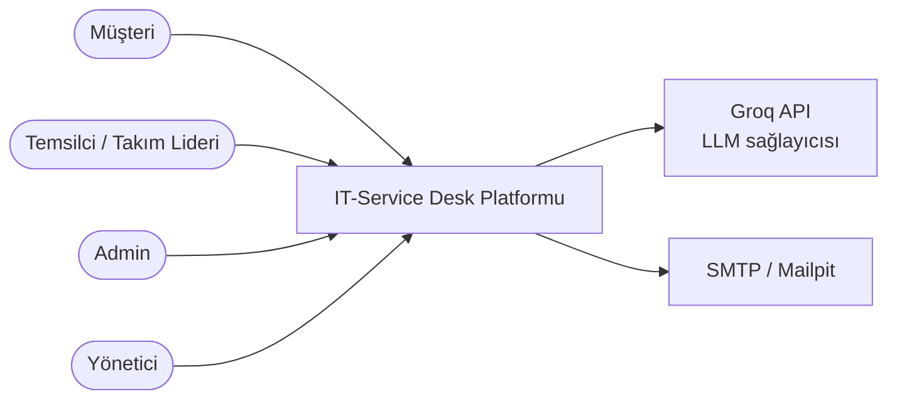
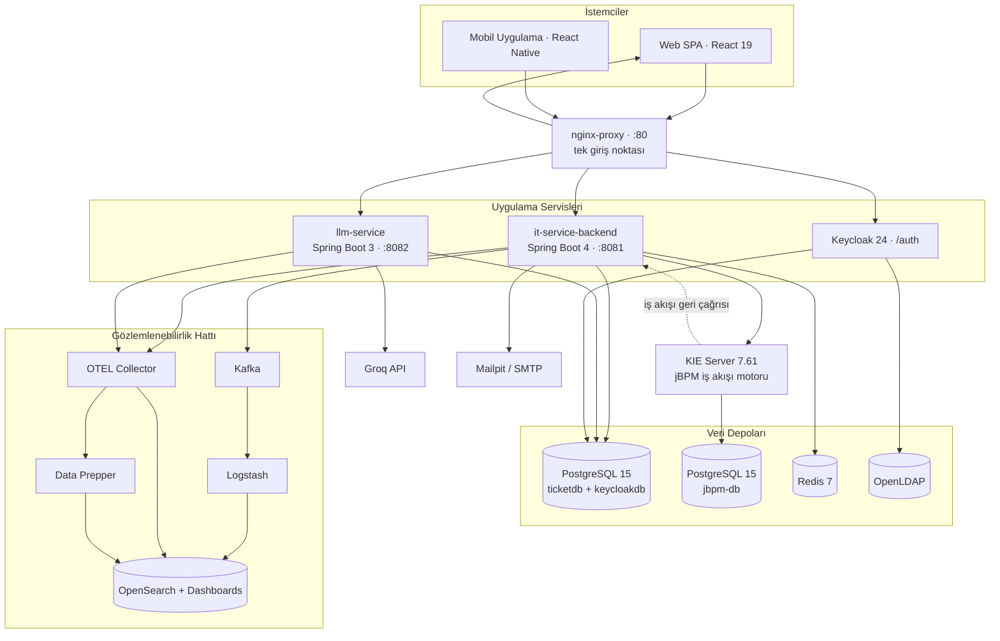
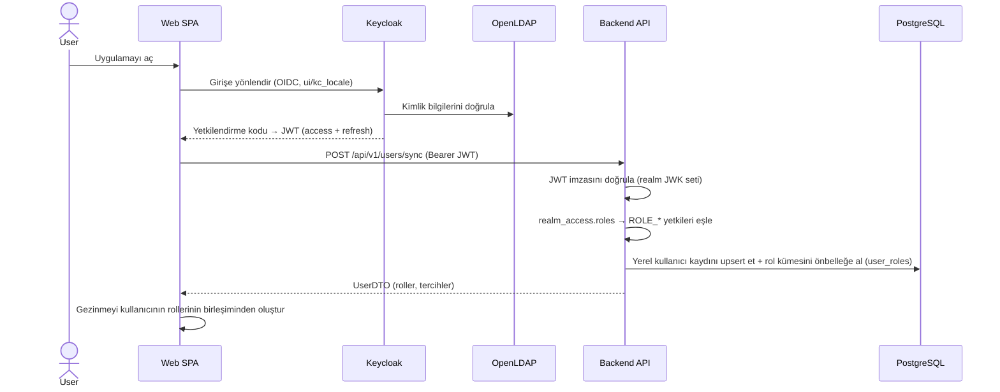
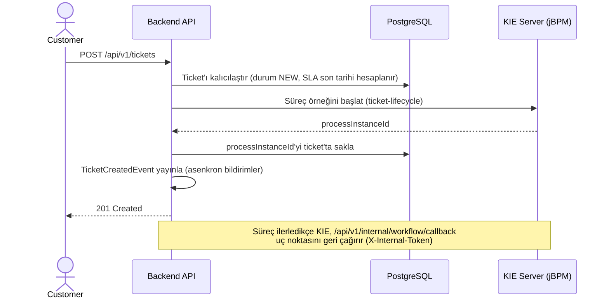
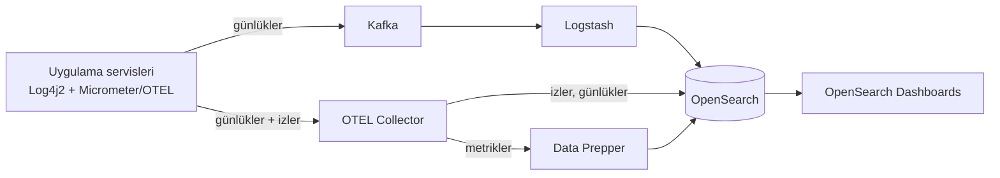
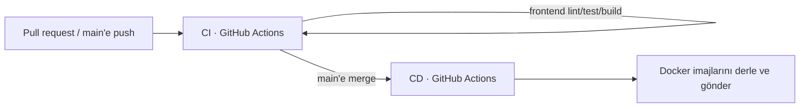

# Architecture

**Türkçe** · [English](ARCHITECTURE.md)

**IT-Service Desk** platformunun teknik mimarisi — çok rollü bir BT Hizmet Yönetimi (ticket) sistemi. Bu doküman; sistem yapısını, ana çalışma zamanı akışlarını, güvenlik modelini ve bunların ardındaki temel tasarım kararlarını ele alır.

Kurulum ve komutlar için [README](../README.tr.md) dosyasına; operasyonel prosedürler için [RUNBOOK](../RUNBOOK.md) dosyasına bakın.

---

## 1. Genel Bakış

Platform; **müşterilerin** destek ticket'ı oluşturmasına, **temsilcilerin** bunları SLA kuralları çerçevesinde çözmesine ve **yöneticilerin** operasyonu panolar üzerinden izlemesine olanak tanır. API, yapay zekâ, kimlik, iş akışı, veri, mesajlaşma, gözlemlenebilirlik gibi her bir sorumluluğun bağımsız ve ayrı olarak dağıtılabilir bir servis olarak çalıştığı, **konteynerleştirilmiş ve çok dilli (polyglot) bir monorepo** olarak sunulur.

Tasarım hedefleri şunlardır: sorumlulukların net biçimde ayrılması, durumsuz (stateless) ve yatayda ölçeklenebilen uygulama servisleri, dışsallaştırılmış yapılandırma ve uçtan uca gözlemlenebilirlik.

---

## 2. Mimari Tarz

| Yön | Yaklaşım |
|--------|----------|
| **Topoloji** | Mikroservis eğilimli: tek bir ters proxy arkasında ayrık konteynerler |
| **Backend** | Klasik katmanlı mimari (Controller → Service → Repository) |
| **Frontend** | Tek Sayfa Uygulaması (SPA, React) + bir React Native mobil istemci |
| **İletişim** | İstemciler ve servisler arasında senkron REST (JSON); canlı güncellemeler için STOMP/WebSocket; iş akışı motorundan HTTP geri çağrıları |
| **Kimlik** | Keycloak'a dışsallaştırılmış — uygulamalar asla parola saklamaz |
| **Durum** | Uygulama servisleri **durumsuzdur** (JWT tabanlı, sunucu oturumu yok); tüm durum PostgreSQL / Redis içinde tutulur |
| **Yapılandırma** | 12-factor: ortam değişkenleri, Spring profilleri, `application.yml` |
| **Şema yönetimi** | Sürümlenmiş veritabanı migrasyonları (Flyway); Hibernate `validate` modunda çalışır |

---

## 3. Sistem Bağlamı



Platform, iki harici bağımlılıkla entegre olur: yapay zekâ özetlemesi için **Groq API** ve giden e-posta için bir **SMTP sunucusu** (geliştirmede Mailpit).

Personel (staff) rolleri **eklemelidir (additive)** — bir kullanıcı bir rol *kümesi* taşır ve etkin yetkileri bunların birleşimidir. Beş rol üç ekseni kapsar: **operasyonel** (`agent`, ticket'ları talep eder ve üzerinde çalışır; `agent`'ın Keycloak bileşiği olan `lead_agent` ayrıca atama yapar, talep etmeden işlem yapar ve ürün içeriğini yönetir), **yapılandırma** (`admin` — global sistem kurulumu) ve **gözetim** (`manager` — global, salt okunur panolar ve raporlama). `customer` son kullanıcıdır ve **tekil (singleton) bir roldür**: her personel rolüyle karşılıklı olarak dışlayıcıdır (bir müşteri aynı anda agent/lead_agent/admin/manager olamaz) ve backend, onu başka bir rolle birleştiren her kombinasyonu reddeder. "Süper yönetici" hesabı yalnızca `admin` + `lead_agent` + `manager` rollerinin tümünü taşıyan bir kullanıcıdır (ör. `superadmin` seed kullanıcısı) — özel bir süper yönetici rolü yoktur.

---

## 4. Konteyner Diyagramı

Tüm dış trafik, `80` numaralı port üzerindeki **nginx** üzerinden girer. Üretime yakın bir dağıtımda hiçbir uygulama servisi veya veri deposu doğrudan dışa açılmaz.



### Yönlendirme (nginx)

| Yol | Hedef |
|------|--------|
| `/` | `it-service-frontend` (statik SPA) |
| `/api/v1/` | `it-service-backend:8081` |
| `/api/v1/ai/` | `llm-service:8082` |
| `/auth/` | `keycloak-iam:8080` |

---

## 5. Bileşenler ve Sorumluluklar

| Bileşen | Yığın | Sorumluluk |
|-----------|-------|----------------|
| **it-service-backend** | Spring Boot 4 / Java 21 | Çekirdek REST API — ticket'lar, SLA, kullanıcılar, yorumlar, ekler, bildirimler, panolar. `ticketdb` şemasının sahibi. |
| **llm-service** | Spring Boot 3 / Java 21 | Groq API aracılığıyla yapay zekâ destekli ticket özetlemesi. `ticketdb`'yi izole bir Flyway geçmiş tablosuyla paylaşır. |
| **it-service-frontend** | React 19 + Vite | Web SPA — rol kapsamlı arayüzler; gezinme (navigation), kullanıcının rollerinin **birleşiminden** oluşturulur (customer, agent, lead_agent, admin, manager). React Native mobil istemci de aynı bileşimi yansıtır. |
| **it-service-mobile** | React Native + Expo | Web uygulamasıyla işlevsel paritede mobil istemci. |
| **ticket-workflow-kjar** | jBPM / BPMN 2.0 | KIE Server'a dağıtılan `ticket-lifecycle` süreç tanımı. |
| **Keycloak** | Keycloak 24 | Kimlik sağlayıcısı — OAuth2/OIDC, `TicketSystemRealm` realm'i, LDAP'tan federe edilen kullanıcılar. |
| **OpenLDAP** | OpenLDAP | Dizin sunucusu — kullanıcı hesapları için tek doğruluk kaynağı. |
| **KIE Server** | jBPM 7.61 (WildFly) | İş akışı sürecini barındırır; kendi PostgreSQL veritabanıyla desteklenir. |
| **PostgreSQL** | PostgreSQL 15 | `ticketdb` (uygulama) ve `keycloakdb` (Keycloak); `jbpm-db` ayrı bir örnektir. |
| **Redis** | Redis 7 | Dağıtık hız sınırı kovaları (rate-limit buckets); gelecekteki önbellek/kuyruk kullanımı için hazırlık alanı. |
| **Kafka + Logstash** | Kafka 3.7 | OpenSearch'e log taşıma tamponu ve tüketicisi. |
| **OTEL Collector + Data Prepper** | OpenTelemetry | Telemetri alımı; izleri/günlükleri/metrikleri OpenSearch'e dağıtır. |
| **OpenSearch** | OpenSearch 3.6 | Günlükler, izler ve metrikler için keşfe yönelik Dashboards içeren birleşik depo. |
| **nginx** | nginx | Ters proxy ve tek giriş noktası. |
| **data-generator** | Java | API aracılığıyla gerçekçi demo verisi oluşturan bağımsız araç. |

---

## 6. Backend İç Yapısı

Backend, `com.ticketsystem.it_service_backend` altında geleneksel bir Spring katmanlı mimarisini izler:

```
controller/   /api/v1/** altındaki REST uç noktaları — doğrulama, HTTP eşleme
service/      İş mantığı (TicketService, SlaPolicyService, WorkflowService,
              NotificationService, EmailService, MetricsService, KeycloakAdminService...)
repository/   Spring Data JPA repository'leri
entity/       JPA entity'leri (Hibernate, ddl-auto = validate)
dto/          İstek/yanıt modelleri — entity'ler asla API sınırını geçmez
event/        @EventListener / @Async alan-olayı (domain-event) işleyicileri
scheduler/    Cron tabanlı görevler (SLA izleme, bildirimler)
filter/       Hız sınırlama filtresi
interceptor/  İstek günlükleme
websocket/    Canlı güncellemeler için STOMP yapılandırması
config/       Güvenlik, önbellek, Redis, yerelleştirme, OpenAPI yapılandırması
exception/    Genel istisna işleyicisi → standart API hata biçimi
```

Kesişen davranışlar merkezileştirilmiştir: bir `GlobalExceptionHandler` tutarlı bir hata zarfı üretir, Bean Validation mesajları yerelleştirilir ve metot düzeyinde güvenlik (`@PreAuthorize`) yetkilendirmeyi iş mantığına yakın bir noktada uygular.

---

## 7. Temel Çalışma Zamanı Akışları

### 7.1 Kimlik Doğrulama ve Yetkilendirme



Backend saf bir **OAuth2 Resource Server**'dır: durumsuz, yalnızca JWT, imza Keycloak realm'inin JWK setine karşı doğrulanır. Sunucu tarafı oturum yoktur.

### 7.2 Ticket Oluşturma (iş akışı orkestrasyonu ile)



KIE Server kullanılamıyorsa çağrı bir **devre kesici (circuit breaker)** ile sarılır — ticket yine de oluşturulur ve `processInstanceId` daha sonra mutabık kılınır; böylece iş akışı motoru çekirdek API'yi asla bloklamaz.

### 7.3 SLA İzleme

SLA son tarihi, ticket oluşturulduğunda önceliğe göre politikadan hesaplanır. Bir **zamanlayıcı** periyodik olarak çalışır ve:

- son tarihi geçmiş ticket'ları **ihlal edilmiş (breached)** olarak işaretler ve temsilcilere + yöneticilere bildirir;
- uyarı eşiğine yaklaşan ticket'ları işaretler ve atanan temsilcilere bildirir.

SLA sayacı, bir ticket `WAITING_FOR_CUSTOMER` veya `RESOLVED` durumundayken **duraklar** ve `IN_PROGRESS` durumuna dönüldüğünde yeniden başlar; böylece müşteri kaynaklı gecikmeler ve onay bekleme süresi destek ekibinin aleyhine sayılmaz. Yalnızca **aktif (sayan) süre** biriktirilir (`slaElapsedMs`): devam ettirmede (`resumeSla`) `slaDeadline`, devam etme anından itibaren kalan aktif bütçe (`getSlaDurationMs(priority) - slaElapsedMs`) kadar ileri projekte edilir; böylece hem rozet hem de ihlal zamanlayıcısı duraklatmada geçen süreyi kaybetmez. Ticket `CLOSED` olduğunda SLA tamamen sonlanır ve sayaç kalıcı olarak durur. Duraklatma/devam ettirme, sinyaller aracılığıyla jBPM sürecine de yansıtılır.

### 7.4 Yapay Zekâ Özeti

Frontend, `llm-service`'i (`/api/v1/ai/` üzerinden) çağırır. Servis; ticket'ı, yorumlarını, çalışma kayıtlarını, çözüm notunu ve denetim geçmişini toplar, dile özgü bir komut istemi (prompt) oluşturur, Groq API'yi çağırır ve özeti kalıcılaştırır. Görece maliyetli olan bu uç noktayı, IP başına ayrılmış bir hız sınırı korur.

### 7.5 Panolar ve Metrikler

`MetricsService`, rol kapsamlı panoları Caffeine ile önbelleğe alınmış agregasyonlardan sunar:

- **Kişisel panolar** — her kullanıcının yalnızca kendine ait bir görünümü vardır: bir müşteri **Genel Bakış** (`customer_id` ile kapsamlanır) ve bir temsilci **Performansım** görünümü (talep/claim ile kapsamlanır); `/api/v1/metrics/me/customer` ve `/me/agent` uç noktalarından sunulur.
- **Ürün-bazlı panolar** — Ürünler panelinden erişilebilen, ürün kapsamlı bir görünüm (durum / öncelik / zaman çizelgesi / SLA / CSAT artı ürün kapsamlı bir temsilci sıralaması); `/products/{productId}/dashboard` uç noktasında; admin/manager için global, lead_agent için ürün kapsamlı.
- **Gözetim detaya inme (drill-down)** — admin / manager / lead, herhangi bir kullanıcının temsilci veya müşteri panosunu açabilir (`/users/{userId}/agent`, `/users/{userId}/customer`); admin/manager globaldir, lead_agent ürün kapsamlıdır.
- **Tarih aralığı kapsamlı KPI'lar** — pano KPI'ları seçilen tarih aralığını izler (sabit 7 günlük pencere yok). SLA uyumu ve ortalama çözüm süresi, yalnızca o anda `RESOLVED` durumunda olanlar üzerinden değil, **dönem içinde çözülen tüm ticket'lar** üzerinden hesaplanır.
- **Grafikler ve uyarılar** — CSAT dağılım/eğilim ve günlük-çalışma-kaydı grafikleri, ayrıca duruma giriş anından itibaren zamanlanan **yapılandırılabilir takılı-ticket uyarıları** (bekleyen/çözülmüş); tıklanabilir satırlara sahip, varsayılan olarak daraltılmış bir afişte (banner) gösterilir.

---

## 8. Güvenlik Modeli

| Konu | Uygulama |
|---------|----------------|
| **Kimlik doğrulama** | Keycloak (OAuth2/OIDC); resource server tarafından doğrulanan JWT (RS256) |
| **Kullanıcı federasyonu** | OpenLDAP — Keycloak'ın kullanıcı deposu; LDAP grupları realm rollerine eşlenir |
| **2FA** | Kullanıcı başına yapılandırılabilir TOTP (kimlik doğrulayıcı uygulama) |
| **Yetkilendirme — kullanıcı uç noktaları** | `realm_access.roles` → `ROLE_*` yetkileri; metot düzeyinde `@PreAuthorize` (+ servis katmanı kapsam/talep kontrolleri için `util/AuthRoles` yardımcıları) |
| **Yetkilendirme — dahili uç noktalar** | `/api/v1/internal/**` JWT'yi atlar; paylaşılan bir `X-Internal-Token` başlığıyla korunur (yalnızca KIE Server geri çağrısı tarafından kullanılır) |
| **Roller** | Personel için **eklemeli çok rollü** (etkin yetki = taşınan kümenin birleşimi): `agent` (ticket talep eder ve üzerinde çalışır), `lead_agent` (`agent` bileşiği; atama, talep etmeden işlem, ürün içeriği yönetimi, takım panosu), `admin` (global sistem yapılandırması), `manager` (global salt okunur gözetim). `customer` (son kullanıcı) **tekil (singleton)** bir roldür — her personel rolüyle karşılıklı olarak dışlayıcıdır; backend onu başka bir rolle birleştirmeyi reddeder. Keycloak'ta tutulur, `user_roles` tablosunda (Flyway V37) önbelleğe alınır, `/users/sync` ile senkronize edilir. Süper yönetici, `admin` + `lead_agent` + `manager` rollerinin tümünü taşıyan bir kullanıcıdır. |
| **Oturum** | Durumsuz (`SessionCreationPolicy.STATELESS`); CSRF devre dışı (çerez yok) |
| **Anonim izin listesi** | Kimlik doğrulama uç noktaları, WebSocket el sıkışması, Swagger UI, `/actuator/health\|info\|metrics` |
| **Hız sınırlama** | Bucket4j token-bucket, Redis aracılığıyla dağıtık; `application.yml` (`app.rate-limit.global-api.*`) ve `RATE_LIMIT_GLOBAL_*` ortam değişkenleriyle yapılandırılır |
| **Girdi güvenliği** | Tüm DTO'larda Bean Validation; ek dosya türü/boyutu denetimleri ve hassas veri taraması |
| **Veri izolasyonu** | Müşteriler yalnızca kendi ticket'larına erişebilir; temsilciler yalnızca talep ettikleri ticket'lar üzerinde işlem yapar; agent / lead_agent yetkili oldukları ürünlerle sınırlandırılır; `admin` ve `manager` globaldir |

---

## 9. Veri Mimarisi

- Tek bir PostgreSQL örneği, **`ticketdb`** (uygulama verisi) ve **`keycloakdb`** (Keycloak) veritabanlarını barındırır. jBPM motoru **ayrı** bir `jbpm-db` örneği kullanır — bu ikisi birbirine karıştırılmamalıdır.
- Şema değişiklikleri yalnızca **Flyway migrasyonları** (`V<n>__*.sql`, şu anda V1–V38) üzerinden yapılır. Hibernate `ddl-auto: validate` olarak çalışır — şemayı asla değiştirmez.
- `llm-service`, `ticketdb`'yi paylaşır ancak **izole bir Flyway geçmiş tablosu** (`flyway_schema_history_llm`, 0'dan baseline'lanmış) tutar; böylece migrasyonları backend'inkilerle çakışmadan bir arada bulunur.
- DTO'lar API sınırını oluşturur; JPA entity'leri asla doğrudan istemcilere serileştirilmez.

Çekirdek tablolar arasında `tickets`, `users`, `user_roles` (önbelleğe alınan eklemeli rol kümesi, Flyway V37), `products`, `ticket_comments`, `ticket_worklogs`, `attachments`, `resolution_notes`, `csat`, `notifications`, `notification_preferences`, `sla_policies`, `ticket_claims`, `agent_product_limits`, `ticket_audit_logs`, `access_requests` ve `known_issues` yer alır.

---

## 10. İş Akışı Entegrasyonu (jBPM)

Her ticket, KIE Server konteyneri `ticket-workflow`'a bir kjar olarak dağıtılan `com.ticketsystem.workflow.ticket-lifecycle` jBPM **süreç örneği** ile desteklenir. BPMN, **tüm** ticket durum değişiklikleri için yetkili (authoritative) durum makinesidir — yalnızca kullanıcı kaynaklı geçişler (`updateTicketStatus` / `closeTicket`) için değil, aynı zamanda claim / unclaim / assign kaynaklı yan-etki geçişleri için de. Bir durum değişikliği BPMN'i ancak backend `transition_<HEDEF>` sinyalini gönderdiğinde ilerletir; yalnızca `status` süreç değişkenini yazmak süreç token'ını eşleşen state node'una taşımaz.

- **Backend → KIE:** `WorkflowService` / `KieServerAdapter`, süreçleri başlatmak, atamayı senkronize etmek ve SLA duraklat/devam et ile kapatma sinyallerini göndermek için KIE Server REST istemcisini kullanır. Durum senkronizasyonu (`syncTicketStatus` / `syncTicketAssignment`) state node'unu `transition_<DURUM>` sinyali ile ilerletir; böylece claim/unclaim/assign sonrası BPMN ile veritabanı tutarlı kalır ve sonraki geçişler başarılı olur (`syncTicketAssignment` ayrıca `assigneeId`'yi düz süreç değişkeni olarak yazar).
- **KIE → Backend:** süreç, statik `X-Internal-Token` başlığıyla kimliği doğrulanan `/api/v1/internal/workflow/callback` uç noktasını geri çağırır.
- **Süreç durumu kalıcılığı:** KIE Server, süreç/geçmiş durumunu geçici bir bellek-içi H2 deposu yerine ayrılmış `jbpm-db` PostgreSQL örneğine (yapılandırılmış bir JBoss datasource aracılığıyla) kalıcılaştırır — böylece süreç örnekleri konteyner yeniden başlatmalarında korunur.
- **Dayanıklılık:** tüm KIE çağrıları bir Resilience4j **devre kesici (circuit breaker)** ile sarılır — iş akışı kesintileri zarif biçimde derecelenir ve ticket API'sini asla bloklamaz. *Bayatlamış (stale)* bir `processInstanceId` (BPMN örneği yok — ör. geçmiş deposu sıfırlanırken ticket `ticketdb` içinde hayatta kaldığı için KIE **404 "process instance not found"** döner), bir sağlık sinyali değil deterministik, örnek-bazlı bir sonuç olarak değerlendirilir: **devre kesici tarafından yok sayılır** (böylece tek bir eksik örnek, diğer her ticket için devreyi asla tetiklemez) ve backend, ticket'ı bloklamak yerine basitçe **veritabanı tarafındaki geçişi kabul eder**.

---

## 11. Gözlemlenebilirlik

Platform; **günlükler, izler ve metrikler** üretir ve bunların hepsi OpenSearch'te birleşir.



- **Günlükler** — Log4j2 yapılandırılmış JSON üretir; hem Kafka → Logstash üzerinden hem de OpenTelemetry log appender'ı aracılığıyla gönderilir.
- **İzler** — Micrometer Tracing, OpenTelemetry'ye köprü kurar; OTLP aracılığıyla dışa aktarılır ve örneklenir (geliştirmede 1.0).
- **Metrikler** — **delta zamansallığı (delta temporality)** ile dışa aktarılır ve Data Prepper üzerinden yönlendirilir; çünkü collector'ın OpenSearch dışa aktarıcısı metrikleri işlemez. Delta zamansallığı, OpenSearch `sum` agregasyonlarının Prometheus tarzı `rate()` olmadan çalışmasını sağlar.
- **Panolar** — birleşik bir "Ticket System Observability" panosu (metrikler + izler + günlükler), `observability/` içinde kayıtlı nesneler olarak sunulur.

---

## 12. Asenkron İşleme ve Zamanlama

Backend, `@EnableAsync` ve `@EnableScheduling` özelliklerini etkinleştirir:

- **Alan olayları (domain events)** — ticket oluşturma gibi eylemler, asenkron olarak işlenen olaylar yayınlar (`@EventListener` + `@Async`); böylece bildirim ve e-posta işleri istek iş parçacığından (thread) uzak tutulur.
- **Zamanlanmış görevler** — cron tabanlı işler, SLA izlemeyi ve bildirim bakımını (ör. süresi dolmuş bildirimlerin temizlenmesi) yürütür.
- **Canlı güncellemeler** — STOMP/WebSocket, bağlı istemcilere ticket detayı olaylarını iletir.

---

## 13. Dayanıklılık ve Performans

| Mekanizma | Amaç |
|-----------|---------|
| **Devre kesici** (Resilience4j) | jBPM/KIE Server arızalarını çekirdek API'den izole eder |
| **Önbellekleme** (Caffeine) | Pano agregasyonları 5 dakikalık TTL ile önbelleğe alınır; ilgili yazmalarda geçersiz kılınır |
| **Hız sınırlama** (Bucket4j + Redis) | API'yi genel olarak korur ve maliyetli yapay zekâ çağrılarını kısıtlar |
| **Bağlantı havuzu** (HikariCP) | Sınırlanmış, ayarlanmış veritabanı bağlantı havuzu |
| **Durumsuz servisler** | Yapışkan (sticky) oturum olmadan yatay ölçeklemeyi mümkün kılar |
| **Zarif derecelenme (graceful degradation)** | İş akışı/yapay zekâ kesintileri, ticket sistemini çökertmeden işlevselliği azaltır |

İşlevsel olmayan hedef, normal yük altındaki tipik işlemler için ~2 saniyenin altında bir yanıt süresidir.

---

## 14. Uluslararasılaştırma ve Tema

- **Diller:** İngilizce ve Türkçe, uçtan uca — SPA (i18next), backend mesajları (`messages_*.properties`), bildirimler, e-postalar ve Keycloak giriş ekranları.
- Kullanıcının tercih ettiği dil kalıcılaştırılır (`users.preferred_language`) ve sunucu tarafı yerelleştirmeyi yönlendirir; bildirimler bir mesaj anahtarı + argümanlar saklar ve okuyanın o anki dilinde **okuma anında oluşturulur**.
- **Tema:** açık/koyu mod, alan adı kapsamlı (domain-scoped) bir çerez aracılığıyla SPA ile özel Keycloak giriş teması arasında paylaşılır; arayüz dili, `kc_locale` parametresi üzerinden Keycloak'a taşınır.

---

## 15. Dağıtım Topolojisi

Aynı imajlardan iki orkestrasyon yolu desteklenir:

- **Docker Compose** (`docker-compose.yaml`) — geliştirme ve demolar için varsayılan tek ana makine yolu.
- **Kubernetes** (`k8s/`) — ortamdan bağımsız bir `base/`, yerel bir kind kümesi için `overlays/local` ve HPA, cert-manager ile SealedSecrets ekleyen bir `overlays/prod` içeren Kustomize.

Her ikisi de `Makefile` (`make up` / `make k8s-up`) üzerinden yürütülür.

### CI/CD



- **CI** her pull request'te ve `main`'e yapılan her push'ta çalışır: backend `mvnw verify` (birim + entegrasyon testleri), llm-service derlemesi, frontend lint + test + build ve Kubernetes manifest doğrulaması (kustomize + kubeconform).
- **CD**, `main` üzerinde başarılı CI sonrasında çalışır: Docker imajlarını derler ve gönderir; geri alma (rollback) için `latest` ve commit SHA etiketleriyle işaretlenir.

---

## 16. Temel Tasarım Kararları

| Karar | Gerekçe |
|----------|-----------|
| **Dışsallaştırılmış kimlik (Keycloak + LDAP)** | Kimlik doğrulamayı şirket içinde inşa etmeden standartlara dayalı SSO, 2FA ve federasyon; uygulamalar parolasız kalır. |
| **Durumsuz JWT resource server** | Yatay ölçeklenebilirlik ve kimlik sağlayıcısı ile API arasında temiz bir ayrım. |
| **Ticket yaşam döngüsü için jBPM** | Yaşam döngüsü, dağınık `if/else` durum mantığı yerine açık ve incelenebilir bir BPMN sürecidir. |
| **İş akışı motoru çevresinde devre kesici** | Çekirdek ticket API'si, KIE Server kapalı olsa bile kullanılabilir kalmalıdır. |
| **Tek gözlemlenebilirlik arka ucu (OpenSearch)** | Günlükler, izler ve metrikler tek bir depoyu ve tek bir sorgu arayüzünü paylaşır — işletilecek daha az hareketli parça. |
| **Data Prepper üzerinden delta zamansallıklı metrikler** | OTEL collector'ın OpenSearch dışa aktarıcısı metrik üretemez; delta zamansallığı, OpenSearch agregasyonlarının `rate()` olmadan çalışmasını sağlar. |
| **`ddl-auto: validate` ile Flyway** | Şema sürümlenmiş, incelenebilir ve yeniden üretilebilir; Hibernate onu asla sessizce değiştiremez. |
| **Paylaşılan `ticketdb`, llm-service için izole Flyway geçmişi** | Yapay zekâ servisi, servisler arası bir çağrı olmadan alan verisini yeniden kullanır; migrasyonlar ise bağımsız kalır. |
| **Ayrı `jbpm-db`** | Süreç motoru durumu, uygulama verisinden izole edilir. |
| **Çok dilli (polyglot) monorepo** | Birçok hareketli parçası olan bir sistem için tek bir tutarlı geçmiş ve tek bir orkestrasyon giriş noktası. |

---

## 17. İşlevsel Olmayan Gereksinimler — Karşılanma Durumu

| Gereksinim | Nasıl karşılanıyor |
|-------------|---------------|
| **Konteynerleştirme** | Her bileşen izole bir konteyner olarak çalışır; Docker Compose **ve** Kubernetes orkestrasyonu. |
| **Katmanlı backend** | Controller → Service → Repository, dışsallaştırılmış yapılandırma ve standart bir hata biçimi ile. |
| **Kalıcılık (persistence)** | Normalleştirilmiş PostgreSQL şeması, JPA/Hibernate ORM, Flyway migrasyonları. |
| **Günlükleme** | Log4j2, yapılandırılmış JSON, anlamlı seviyeler, OpenSearch'e gönderim (doğrudan ve Kafka üzerinden). |
| **Gözlemlenebilirlik** | OpenTelemetry izleri + metrikleri; istek hacmi, gecikme, hata oranı ve servis sağlığı panoları. |
| **Güvenlik** | Keycloak + LDAP, RBAC, 2FA, web ve mobil için OAuth2/OIDC token oturumları. |
| **İş akışı** | Ticket durum geçişlerini yürüten jBPM süreç tanımı, depo içinde bir BPMN modeliyle. |
| **Performans** | Önbellekleme, havuzlama ve hız sınırlama, normal yük altında 2 saniyenin altında yanıt hedefler. |
| **Test** | Birim testleri (JUnit 5/Mockito), entegrasyon testleri (Testcontainers), JaCoCo kapsamı, SonarQube. |
| **DevOps** | İmajları derleyip yayınlayan GitHub Actions CI/CD hattı. |
| **Dokümantasyon** | Bu doküman, README, RUNBOOK ve etkileşimli bir OpenAPI/Swagger API referansı. |
