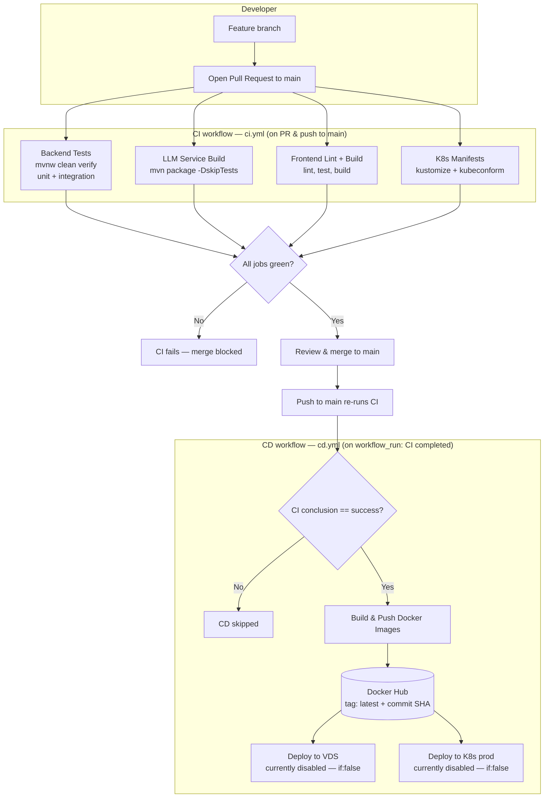

# CI/CD Pipeline

This document describes the Continuous Integration and Continuous Deployment
pipeline for the IT-service ticketing system. The pipeline is implemented with
**GitHub Actions** and lives in two workflow files:

- `.github/workflows/ci.yml` — **CI**: validates every change.
- `.github/workflows/cd.yml` — **CD**: builds and ships Docker images after CI passes.

## Philosophy

The pipeline is built around a few deliberate principles:

- **CI is the gate, CD is the consequence.** No deployment artifact is ever
  produced from code that has not passed the full test suite. CD is triggered by
  a *successful CI run*, not by a raw push, so a red build can never reach the
  registry.
- **Fast feedback on pull requests.** CI runs on every PR targeting `main`, so
  problems are caught before review, not after merge.
- **Reproducible local parity.** Every check the CI server runs can be run
  locally with a single command (`make ci`), so "works on my machine" and
  "passes in CI" mean the same thing.
- **Immutable, traceable images.** Every built image is tagged both with
  `latest` and with the exact commit SHA it was built from, making any deploy
  auditable and any rollback a one-line operation.
- **Deployment is staged, not assumed.** The image build/push stage is fully
  active; the server deploy stages are wired up but intentionally gated off
  until the target infrastructure (a VDS and/or a Kubernetes cluster) is
  provisioned.

## Pipeline at a glance



---

## Continuous Integration

**File:** `.github/workflows/ci.yml`
**Workflow name:** `CI`

### Trigger

CI runs on:

- `pull_request` targeting the `main` branch — validates a change *before* merge.
- `push` to the `main` branch — re-validates the merged result and acts as the
  signal that drives CD (see [Continuous Deployment](#continuous-deployment)).

The workflow runs with `permissions: contents: read` — it only needs to read
the repository.

### Jobs

CI is composed of four independent jobs that run in parallel on
`ubuntu-latest`. The build is green only if **all four** succeed.

#### 1. `Backend Tests (Maven)` — job `backend-tests`

Runs in the `it-service-backend` working directory.

| Step | What it does |
|------|--------------|
| Checkout | `actions/checkout@v4` |
| Set up Java 21 | `actions/setup-java@v4`, Temurin distribution, Maven dependency cache enabled |
| Ensure `mvnw` executable | `chmod +x mvnw` so the Maven Wrapper can run on the Linux runner |
| Run unit + integration tests | `./mvnw -B clean verify` |
| Upload Surefire reports | `actions/upload-artifact@v4`, always runs, artifact `backend-surefire-reports` |
| Upload Failsafe reports | `actions/upload-artifact@v4`, always runs, artifact `backend-failsafe-reports` |

`./mvnw -B clean verify` runs the **full** backend verification:

- **Unit tests** via the Surefire plugin (`*Test.java`).
- **Integration tests** via the Failsafe plugin (`*IT.java`). These extend
  `BaseIntegrationTest` and spin up **Testcontainers** (Postgres, Redis); the
  GitHub-hosted runner provides the Docker daemon they need.
- JaCoCo coverage instrumentation, bound to the `verify` phase.

This job **fails** if any unit or integration test fails, or if the build
itself breaks. Test reports are uploaded as artifacts even on failure
(`if: always()`, `if-no-files-found: ignore`), so a failed run can be diagnosed
from the Surefire/Failsafe XML without re-running locally.

#### 2. `LLM Service Build (Maven)` — job `llm-service-build`

Runs in the `llm-service` working directory.

| Step | What it does |
|------|--------------|
| Checkout | `actions/checkout@v4` |
| Set up Java 21 | `actions/setup-java@v4`, Temurin, Maven cache |
| Build | `mvn -B clean package -DskipTests` |

The LLM service is **compiled and packaged but not tested** in CI. Its tests
require a running Postgres database, which is not provisioned in this job, so
tests are skipped with `-DskipTests`. The job verifies that the service still
**compiles and packages cleanly**; it **fails** on any compilation or packaging
error.

#### 3. `Frontend Lint + Build` — job `frontend-quality`

Runs in the `it-service-frontend` working directory.

| Step | What it does |
|------|--------------|
| Checkout | `actions/checkout@v4` |
| Set up Node 22 | `actions/setup-node@v4`, npm cache keyed on `it-service-frontend/package-lock.json` |
| Install dependencies | `npm ci` (clean, lockfile-exact install) |
| Lint | `npm run lint` (ESLint) |
| Test | `npm test` (Vitest, single run, jsdom + Testing Library) |
| Build | `npm run build` (Vite production build) |

This job exercises the frontend end to end: a lockfile-faithful install, an
ESLint pass, the Vitest suite, and a production Vite build. It **fails** if any
of lint, tests, or the build fail.

#### 4. `K8s Manifests (kustomize + kubeconform)` — job `k8s-manifests`

Validates that the Kubernetes manifests are well-formed.

| Step | What it does |
|------|--------------|
| Checkout | `actions/checkout@v4` |
| Install kubeconform | Downloads `kubeconform` v0.6.7 |
| Provide stub `secrets.env` | Copies `k8s/overlays/local/secrets.env.example` to `secrets.env` so kustomize can render |
| Render and validate | `kubectl kustomize k8s/overlays/local --load-restrictor=LoadRestrictionsNone \| kubeconform -strict -summary -ignore-missing-schemas` |

This job renders the **local kustomize overlay** and validates the resulting
manifests against the Kubernetes schemas with `kubeconform` in strict mode.
`-ignore-missing-schemas` allows CRDs and other non-core resources to pass.
The job **fails** if the overlay does not render or if a manifest is schema-invalid.

### Artifacts

Only the backend job publishes artifacts:

- `backend-surefire-reports` — unit test reports from `target/surefire-reports`.
- `backend-failsafe-reports` — integration test reports from `target/failsafe-reports`.

Both are uploaded unconditionally (`if: always()`) so they are available for
post-mortem on failed runs.

### Pass / fail summary

| Job | Passes when | Fails when |
|-----|-------------|-----------|
| `backend-tests` | `mvnw clean verify` succeeds (all unit + integration tests green) | Any test fails or the build breaks |
| `llm-service-build` | `mvn clean package -DskipTests` succeeds | Compilation or packaging error |
| `frontend-quality` | `npm ci`, lint, test, and build all succeed | Lint, Vitest, or Vite build fails |
| `k8s-manifests` | Local overlay renders and passes `kubeconform -strict` | Render error or schema-invalid manifest |

CI is considered **successful** only when **all four** jobs are green — this is
exactly the condition CD waits on.

### Local equivalent — `make ci`

Before pushing, a developer can run the same gate locally:

```bash
make ci
```

The `ci` target in the `Makefile` runs, in order:

1. `make verify` — `mvnw verify` in `it-service-backend` (unit + integration tests + JaCoCo).
2. `make test-frontend` — `npm test` in `it-service-frontend` (Vitest).
3. `make lint` — `npm run lint` in `it-service-frontend` (ESLint).

On success it prints a `CI PASSED` banner. This mirrors the backend and
frontend CI jobs closely; the `llm-service-build` and `k8s-manifests` jobs do
not have a `make` shortcut and are exercised only by GitHub Actions.

> **Note:** the `Makefile` targets Windows and invokes `mvnw.cmd`. On POSIX,
> run the Maven Wrapper (`./mvnw`) and npm scripts directly.

---

## Continuous Deployment

**File:** `.github/workflows/cd.yml`
**Workflow name:** `CD`

### Trigger

CD does **not** trigger directly on a push. It triggers on a `workflow_run`
event:

```yaml
on:
  workflow_run:
    workflows: ["CI"]
    branches: [main]
    types: [completed]
```

That is: CD starts when the **CI** workflow *completes* on the `main` branch.
A guard then ensures it only proceeds on success —
`if: ${{ github.event.workflow_run.conclusion == 'success' }}` on the
`build-and-push` job. If CI failed (a test, lint, or build error), CD is
skipped and no image is built or pushed.

Like CI, the workflow runs with `permissions: contents: read`.

The commit being deployed is always referenced via
`github.event.workflow_run.head_sha` — the exact SHA that CI validated.

### Job 1 — `Build & Push Docker Images` (`build-and-push`)

This is the **active** stage of CD. It builds and pushes four Docker images.

| Step | Details |
|------|---------|
| Checkout | `actions/checkout@v4` |
| Set up Docker Buildx | `docker/setup-buildx-action@v3` |
| Log in to Docker Hub | `docker/login-action@v3` using `DOCKERHUB_USERNAME` / `DOCKERHUB_TOKEN` secrets |
| Build & push backend | `docker/build-push-action@v5`, context `./it-service-backend`, Dockerfile `./it-service-backend/Dockerfile` |
| Build & push llm-service | `docker/build-push-action@v5`, context `./llm-service`, Dockerfile `./llm-service/Dockerfile` |
| Build & push frontend | `docker/build-push-action@v5`, context `./it-service-frontend` (default Dockerfile) |
| Build & push openldap-server | `docker/build-push-action@v5`, context `.` (repo root), Dockerfile `./Dockerfile-ldap` |

The four images produced and pushed to Docker Hub are:

- `<DOCKERHUB_USERNAME>/it-service-backend`
- `<DOCKERHUB_USERNAME>/llm-service`
- `<DOCKERHUB_USERNAME>/it-service-frontend`
- `<DOCKERHUB_USERNAME>/openldap-server`

The `openldap-server` image is built from the repo root with `Dockerfile-ldap`,
because it needs to copy the `ldap-init/` directory into the image.

#### Image tagging strategy

Every image is pushed with **two tags**:

| Tag | Purpose |
|-----|---------|
| `latest` | The moving "current" tag — what a plain `docker compose pull` / `docker pull` fetches |
| `<commit SHA>` | An **immutable** tag pinned to `github.event.workflow_run.head_sha` |

The commit-SHA tag is the backbone of traceability and rollback:

- Every deployed image can be traced back to the exact commit that produced it.
- A rollback never depends on rebuilding — it is just `docker pull` /
  `docker compose pull` of a previous SHA tag.
- On Kubernetes, pinning deployments to a SHA tag (rather than `latest`)
  prevents "silent" image drift; rolling back is reverting to a previous SHA.

#### Build cache

Every `build-push-action` step uses the GitHub Actions cache backend:

```yaml
cache-from: type=gha
cache-to: type=gha,mode=max
```

This persists Docker layer cache between runs in GitHub Actions storage, so
unchanged layers are not rebuilt. `mode=max` caches all intermediate layers
(not just the final stage), maximising reuse for multi-stage builds.

### Job 2 — `Deploy to VDS` (`deploy`) — **currently disabled**

This job would deploy the new images to a VDS (virtual dedicated server) over
SSH using Docker Compose. **It is gated off** with `if: false`:

```yaml
deploy:
  name: Deploy to VDS
  needs: build-and-push
  if: false            # ← remove this line when a VDS is provisioned
  environment: production
```

It is intentionally inert until a server is available. When enabled, it would:

1. Check out the repo (for `docker-compose.yaml`).
2. `appleboy/scp-action` — copy `docker-compose.yaml` to `/opt/ticketsystem` on the server.
3. `appleboy/ssh-action` — SSH in and:
   - export `DOCKERHUB_USERNAME` and `IMAGE_TAG` (the head SHA);
   - `docker compose pull` the backend, frontend, and llm-service images;
   - restart them one at a time with `--no-deps` (so DB, Keycloak, etc. are
     untouched), with `sleep` pauses between services for startup;
   - `docker image prune -f` to clean up old images.

It declares `environment: production`, so once enabled, a manual approval gate
or environment protection rules can be attached via GitHub Environments.

### Job 3 — `Deploy to K8s (prod overlay)` (`deploy-k8s`) — **currently disabled**

An alternative deployment path to a Kubernetes cluster, also gated off with
`if: false` and `needs: build-and-push`. When enabled, it would:

1. Set up `kubectl` and `kustomize`.
2. Decode a base64 kubeconfig from the `KUBE_CONFIG_BASE64` secret.
3. `kustomize edit set image` to pin the `k8s/overlays/prod` overlay's image
   references to the commit-SHA tag.
4. `kustomize build … | kubectl apply -f -` and wait for the backend, frontend,
   and llm-service deployments to roll out.

It also declares `environment: production`.

### Deployment status summary

| Stage | State | Notes |
|-------|-------|-------|
| Build & push Docker images | **Active** | Runs on every successful CI on `main` |
| Deploy to VDS | **Disabled** (`if: false`) | Enable by removing `if: false` and adding `VDS_*` secrets |
| Deploy to K8s prod overlay | **Disabled** (`if: false`) | Enable by removing `if: false` and adding `KUBE_CONFIG_BASE64` |

In its current state, CD's effective outcome is: **on a successful CI run on
`main`, four freshly built Docker images appear on Docker Hub**, tagged `latest`
and the commit SHA, ready for a (manual or future automated) deploy.

---

## Secrets & Configuration

The pipeline relies on GitHub repository secrets, configured under
**Settings → Secrets and variables → Actions**. Values are never committed to
the repository.

### Currently required (used by the active CD stage)

| Secret | Used by | Description |
|--------|---------|-------------|
| `DOCKERHUB_USERNAME` | `build-and-push` | Docker Hub account/namespace; also forms the image name prefix |
| `DOCKERHUB_TOKEN` | `build-and-push` | Docker Hub **access token** (not the account password) used for `docker login` |

### Required only when the disabled deploy stages are enabled

| Secret | Used by | Description |
|--------|---------|-------------|
| `VDS_HOST` | `deploy` | Hostname or IP of the target VDS |
| `VDS_USER` | `deploy` | SSH username on the VDS |
| `VDS_SSH_KEY` | `deploy` | Private SSH key (PEM) for connecting to the VDS |
| `KUBE_CONFIG_BASE64` | `deploy-k8s` | Base64-encoded kubeconfig for the target Kubernetes cluster |

### GitHub Environment

The `deploy` and `deploy-k8s` jobs declare `environment: production`. A GitHub
Environment named **`production`** can be configured (Settings → Environments)
to add:

- **Required reviewers** — a manual approval gate before any deploy runs.
- **Environment-scoped secrets** — e.g. keeping `VDS_*` / `KUBE_CONFIG_BASE64`
  scoped to `production` rather than repository-wide.
- **Deployment branch rules** — restricting which branches may deploy.

> CI itself requires no secrets — it only reads the repository
> (`permissions: contents: read`).

---

## Branching & Versioning

### Branching model

- `main` is the **integration and release branch**. Production images are built
  from `main` only.
- All work happens on **feature branches**, merged into `main` via **pull
  request**.
- CI runs on every PR to `main` and on every push to `main`.

**Recommended branch protection** for `main` (GitHub → Settings → Branches):

- Require the CI status checks to pass before merging
  (`Backend Tests (Maven)`, `LLM Service Build (Maven)`,
  `Frontend Lint + Build`, `K8s Manifests (kustomize + kubeconform)`).
- Require a pull request review before merging.
- Disallow direct pushes / bypassing the rules.

This makes the "CI gate before CD" contract structural rather than conventional.

### Image versioning

There is no separate semantic version embedded in the Docker images. Versioning
is **commit-driven**:

- `latest` — always points at the most recent successful build from `main`.
- `<commit SHA>` — an immutable, per-commit tag (the head SHA validated by CI).

The commit SHA is the unit of versioning: it identifies exactly what is
deployed and is the handle used for rollback. Human-readable releases can be
layered on top via Git tags / GitHub Releases without changing the pipeline.

---

## Local verification

Before opening a PR or pushing to `main`, run the **same gate CI enforces**:

```bash
make ci
```

This runs backend `verify` (unit + integration tests + JaCoCo), the frontend
Vitest suite, and ESLint — and prints a `CI PASSED` banner on success.

To run individual pieces:

| Check | Command | CI counterpart |
|-------|---------|----------------|
| Backend unit + integration tests | `cd it-service-backend && ./mvnw verify` | `backend-tests` job |
| Backend single test class | `./mvnw test -Dtest=ClassName` | — |
| LLM service package | `cd llm-service && ./mvnw clean package -DskipTests` | `llm-service-build` job |
| Frontend lint | `cd it-service-frontend && npm run lint` | `frontend-quality` (lint step) |
| Frontend tests | `cd it-service-frontend && npm test` | `frontend-quality` (test step) |
| Frontend build | `cd it-service-frontend && npm run build` | `frontend-quality` (build step) |
| K8s manifest validation | `kubectl kustomize k8s/overlays/local --load-restrictor=LoadRestrictionsNone \| kubeconform -strict -summary -ignore-missing-schemas` | `k8s-manifests` job |

Notes:

- Backend integration tests (`*IT.java`) require a running **Docker** daemon —
  they use Testcontainers (Postgres, Redis).
- The `Makefile` is Windows-first and calls `mvnw.cmd`; on POSIX, call
  `./mvnw` and the npm scripts directly.
- Running `make ci` clean locally is the strongest signal that a push will keep
  CI — and therefore CD — green.
