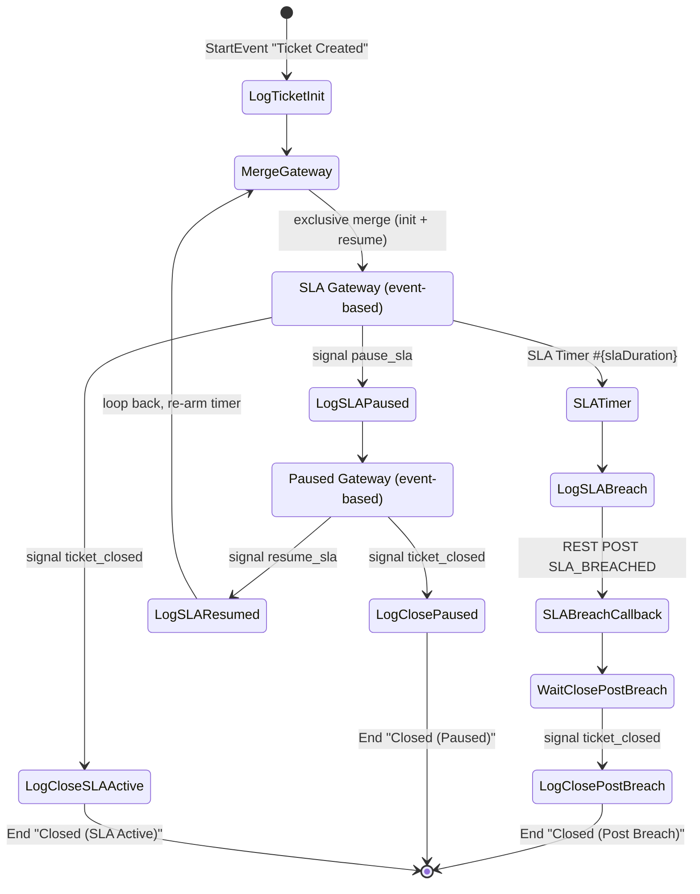

# Ticket Lifecycle Workflow (jBPM / BPMN)

This document describes how the IT-service ticketing system models the **ticket
lifecycle** as an executable **BPMN 2.0 process** running on a jBPM **KIE Server**,
and how the Spring Boot backend integrates with it.

## Why model the lifecycle as a BPMN process?

A ticket is fundamentally a **long-running, stateful, event-driven** entity: it
sits idle waiting for an SLA deadline, can be paused while waiting for the
customer, resumed, and finally closed — possibly hours or days after it was
created. Encoding that behaviour as imperative Java scattered across services
makes the state machine implicit and hard to reason about.

Modelling it as a BPMN process gives:

- **An explicit, visual state machine.** The `.bpmn2` file *is* the single
  source of truth for "what states can a ticket be in and how does it move
  between them".
- **A durable, managed SLA timer.** jBPM persists timers in its own database;
  an SLA deadline survives backend restarts and fires reliably without a
  custom scheduler holding the countdown.
- **Event-driven transitions via signals.** Pause / resume / close are delivered
  as named BPMN signals — the process reacts asynchronously instead of the
  backend polling.
- **Separation of concerns.** `WorkflowService` isolates the rest of the
  backend (especially `TicketService`) from all jBPM/KIE details.

The backend remains the system of record for tickets; the workflow engine is a
**collaborator** that owns the SLA timer and emits a callback when the deadline
is breached. The backend can fully function (degraded) if the KIE Server is
down — see *Resilience* below.

---

## Process Identity

| Property | Value |
|---|---|
| KIE Server image | `jboss/kie-server-showcase:7.61.0.Final` (jBPM 7.61, WildFly, standalone / unmanaged mode) |
| `kie-server-client` (backend) | `7.61.0.Final` — deliberately aligned with the server version |
| KIE Server id | `ticket-kie-server` |
| Container id (KIE deployment unit) | `ticket-workflow` |
| Process id | `com.ticketsystem.workflow.ticket-lifecycle` |
| Process name | `Ticket Lifecycle Process` |
| kjar artifact | `com.ticketsystem:ticket-workflow-kjar:1.0.5` (`packaging=kjar`) |
| BPMN source | `ticket-workflow-kjar/src/main/resources/com/ticketsystem/workflow/ticket-lifecycle.bpmn2` |
| KIE Server REST base | `http://kie-server:8080/kie-server/services/rest/server` (host: `http://localhost:8180/...`) |
| KIE Server Swagger UI | `http://localhost:8180/kie-server/docs` |
| Process history DB | `jbpm-db` (separate PostgreSQL container — **not** `ticketdb`) |

The kjar carries two descriptors under `src/main/resources/META-INF/`:

- **`kmodule.xml`** — empty `<kmodule>`; the default KieBase/KieSession auto-scan
  every `.bpmn2` under `src/main/resources`.
- **`kie-deployment-descriptor.xml`** — declares JPA persistence
  (`org.jbpm.domain`), `audit-mode=JPA`, **`runtime-strategy=PER_PROCESS_INSTANCE`**,
  and registers the **`Rest`** work-item handler
  (`org.jbpm.process.workitem.rest.RESTWorkItemHandler`). The `Rest` handler is
  what lets the BPMN process call back into the backend over HTTP.

---

## Process Model

The process runs **two parallel branches** that share the same process instance:

1. **State branch** — the **authoritative state machine** for the ticket. Each
   ticket status (`NEW`, `IN_PROGRESS`, `WAITING_FOR_CUSTOMER`, `RESOLVED`,
   `CLOSED`) is an explicit wait node. Backend signals `transition_<TARGET>` to
   move from one state to another; **only the source state's wait node listens
   for the signal**, so invalid transitions are silently ignored by the engine.
   Valid transitions are therefore encoded by the BPMN graph itself rather than
   by a Java map. Reaching `CLOSED` triggers a **terminate end event** that
   stops the entire process (including the SLA branch).

2. **SLA branch** — the original event-based flow around the SLA timer. Waits
   for whichever happens first: the SLA timer expiring, a `pause_sla` signal,
   or a `ticket_closed` signal. Kept for backward compatibility with the
   existing pause/resume side-effects in `TicketService`.

After `ScriptTask_Init` a `Gateway_ParallelSplit` (parallel gateway) forks
execution into the two branches above.

### Nodes (as defined in `ticket-lifecycle.bpmn2`)

**Start event**

- `StartEvent_1` — *"Ticket Created"* — fires when the backend starts a process
  instance for a newly created ticket.

**Script tasks** (each writes a `System.out.println` log line on the KIE Server)

- `ScriptTask_Init` — *"Log Ticket Init"*
- `ScriptTask_BreachLog` — *"Log SLA Breach"*
- `ScriptTask_PauseLog` — *"Log SLA Paused"*
- `ScriptTask_ResumeLog` — *"Log SLA Resumed"*
- `ScriptTask_CloseInSlaLog` — *"Log Close (SLA Active)"*
- `ScriptTask_CloseInPausedLog` — *"Log Close (Paused)"*
- `ScriptTask_PostBreachClose` — *"Log Close Post Breach"*

**Gateways**

- `Gateway_XorMerge` — *"Merge Gateway"* — converging exclusive gateway; joins
  the **Init** path and the **resume** path so both feed the same SLA wait point
  (this is what makes resume a *loop* back into the SLA countdown).
- `Gateway_Sla` — *"SLA Gateway"* — **event-based** diverging gateway; waits for
  the SLA timer, `pause_sla`, or `ticket_closed`.
- `Gateway_Paused` — *"Paused Gateway"* — **event-based** diverging gateway;
  while paused, waits for `resume_sla` or `ticket_closed`.

**Timer (intermediate catch event)**

- `Timer_SlaDeadline` — *"SLA Timer"* — `timeDuration = #{slaDuration}`
  (ISO-8601 duration resolved from the `slaDuration` process variable, so each
  ticket gets a deadline derived from its priority).

**Signal intermediate catch events**

- `Signal_PauseSla_Catch` — *"Pause SLA Signal"* — catches signal `pause_sla`.
- `Signal_ResumeSla_Catch` — *"Resume SLA Signal"* — catches signal `resume_sla`.
- `Signal_Close_InSla` — *"Close (SLA Active)"* — catches `ticket_closed` while
  the SLA is counting down.
- `Signal_Close_InPaused` — *"Close (Paused)"* — catches `ticket_closed` while
  the ticket is paused.
- `Signal_Close_PostBreach` — *"Close (Post Breach)"* — catches `ticket_closed`
  after the SLA has already been breached.

**Service task (REST work item)**

- `RestTask_SlaCallback` — *"SLA Breach Callback"* — a `drools:taskName="Rest"`
  task handled by the `RESTWorkItemHandler`. After the timer fires it sends an
  HTTP **POST** to `#{callbackUrl}` with `Content-Type: application/json` and
  body:
  ```json
  {"ticketId": #{ticketId}, "eventType": "SLA_BREACHED",
   "processInstanceId": #{processInstanceId}, "additionalData": "Priority: #{priority}"}
  ```

**End events**

- `EndEvent_ClosedFromSla` — *"Closed (SLA Active)"*
- `EndEvent_ClosedFromPaused` — *"Closed (Paused)"*
- `EndEvent_ClosedPostBreach` — *"Closed (Post Breach)"*

### Signals declared

**State branch — transition signals (`transition_<TARGET>`):**

| Signal id | Signal name | Sent by backend via |
|---|---|---|
| `Signal_TransitionNew` | `transition_NEW` | `WorkflowService.requestStatusTransition(ticket, "NEW")` |
| `Signal_TransitionInProgress` | `transition_IN_PROGRESS` | `WorkflowService.requestStatusTransition(ticket, "IN_PROGRESS")` |
| `Signal_TransitionWaitingForCustomer` | `transition_WAITING_FOR_CUSTOMER` | `WorkflowService.requestStatusTransition(ticket, "WAITING_FOR_CUSTOMER")` |
| `Signal_TransitionResolved` | `transition_RESOLVED` | `WorkflowService.requestStatusTransition(ticket, "RESOLVED")` |
| `Signal_TransitionClosed` | `transition_CLOSED` | `WorkflowService.requestStatusTransition(ticket, "CLOSED")` |

The receiving state node decides whether the signal is accepted — e.g. the
`State_NEW` node listens only for `transition_IN_PROGRESS` and
`transition_CLOSED`, so a `transition_RESOLVED` arriving while the ticket is
in `NEW` is dropped by the engine. There is **no parallel Java map** of valid
transitions; the BPMN diagram is the single source of truth.

`TicketService.validateStateTransition` realises this by signalling the BPMN
with `transition_<TARGET>` and immediately reading the process variable back
via `WorkflowService.verifyTransitionApplied`. If the variable did not advance
to the requested target (signal silently dropped → invalid transition) the
service throws HTTP `400`. If KIE Server is unreachable the verify call also
returns `false`, surfacing as a `400` to the caller — the workflow engine is
treated as a hard dependency for status transitions.

**SLA branch — lifecycle signals (legacy, kept for backward compatibility):**

| Signal id | Signal name | Sent by backend via |
|---|---|---|
| `Signal_PauseSla` | `pause_sla` | `WorkflowService.pauseSla()` |
| `Signal_ResumeSla` | `resume_sla` | `WorkflowService.resumeSla()` |
| `Signal_TicketClosed` | `ticket_closed` | `WorkflowService.closeTicketWorkflow()` |

### Flow walk-through

1. **Start → Init → Merge → SLA Gateway.** A new ticket starts the process;
   `ScriptTask_Init` logs it; control reaches the converging `Merge Gateway`
   and then the event-based `SLA Gateway`.
2. **SLA Gateway** waits for the first of three events:
   - **Timer fires** → `ScriptTask_BreachLog` → `RestTask_SlaCallback` (POSTs
     `SLA_BREACHED` to the backend) → wait at `Signal_Close_PostBreach`. When
     `ticket_closed` arrives → `ScriptTask_PostBreachClose` →
     **End: Closed (Post Breach)**.
   - **`pause_sla`** → `ScriptTask_PauseLog` → `Paused Gateway`.
   - **`ticket_closed`** → `ScriptTask_CloseInSlaLog` → **End: Closed (SLA Active)**.
3. **Paused Gateway** waits for the first of two events:
   - **`resume_sla`** → `ScriptTask_ResumeLog` → loops back into the **Merge
     Gateway**, re-entering the SLA Gateway and re-arming the timer with the
     *remaining* `slaDuration`.
   - **`ticket_closed`** → `ScriptTask_CloseInPausedLog` → **End: Closed (Paused)**.

Pause/resume can repeat any number of times. The timer is re-created each time
the SLA Gateway is re-entered, so the SLA "clock" is effectively suspended while
the ticket is in the paused branch.

### Diagram



> The diagram mirrors the `.bpmn2` exactly: one start event, seven script
> tasks, one REST task, three gateways (`XorMerge`, `SLA`, `Paused`), one timer
> catch event, five signal catch events, and three end events.

---

## Process Variables

All variables are typed `String` (`itemDefinition structureRef="String"`).

| Variable | Direction | Set by | Purpose |
|---|---|---|---|
| `ticketId` | in | `startTicketWorkflow()` | Ticket primary key; echoed in the SLA-breach callback body. |
| `priority` | in | `startTicketWorkflow()` | Ticket priority; drives the SLA duration and is included in `additionalData`. |
| `customerId` | in | `startTicketWorkflow()` | Customer who raised the ticket. |
| `status` | in / updated | `startTicketWorkflow()`, `syncTicketStatus()`, `syncTicketAssignment()` | Current ticket status, kept in sync with the DB. |
| `assigneeId` | updated | `syncTicketAssignment()` | Id of the agent who last claimed the ticket. |
| `slaDuration` | in / updated | `startTicketWorkflow()`, `resumeSla()` | ISO-8601 duration (e.g. `PT30M`, `PT1H30M`) used by `Timer_SlaDeadline`. On resume it is rewritten to the *remaining* time. |
| `callbackUrl` | in | `startTicketWorkflow()` | Backend internal callback URL **with the auth token appended** (`...?token=<token>`); used by `RestTask_SlaCallback`. |
| `processInstanceId` | engine-provided | jBPM runtime | Referenced in the REST callback body; the backend persists the returned instance id on the `Ticket` entity. |

`startTicketWorkflow()` seeds `ticketId`, `priority`, `customerId`, `status`,
`slaDuration`, `callbackUrl`. New tickets always start in status `NEW` (no claim
information yet).

---

## Backend → KIE integration

### Wiring

- **`KieClientConfig`** builds the shared `KieServicesClient` bean
  (`KieServicesFactory.newRestConfiguration(url, username, password)`,
  `MarshallingFormat.JSON`, configurable timeout, default 30 s). On startup it
  pings `getServerInfo()`; a failed ping is logged but the application still
  starts (workflow features simply degrade). It also defines the
  `kieServerCircuitBreaker` bean.
- **`KieServerAdapter`** is the single place that touches the KIE client. From
  `KieServicesClient` it derives `ProcessServicesClient`, `QueryServicesClient`,
  `UserTaskServicesClient`, and `ProcessAdminServicesClient`. Every call is
  wrapped in the Resilience4j circuit breaker.
- **`WorkflowService`** is the business-facing layer; it converts ticket data
  into process variables and delegates to `KieServerAdapter`. It keeps
  `TicketService` free of jBPM details.

Connection settings come from `jbpm.kie-server.*` in `application.yml` (env vars
`JBPM_KIE_SERVER_URL/USERNAME/PASSWORD/CONTAINER_ID/PROCESS_ID/TIMEOUT/CALLBACK_TOKEN/CALLBACK_BASE_URL`).

### Starting a process

`TicketService` publishes a `TicketCreatedEvent`. `WorkflowEventListener`
handles it with `@TransactionalEventListener(AFTER_COMMIT)` +
`@Transactional(REQUIRES_NEW)` — the process is only started **after** the
ticket commit succeeds, in a fresh transaction:

1. `WorkflowService.startTicketWorkflow(ticket)` builds the process variable map
   (including `slaDuration` from `SlaPolicyService.getSlaDurationMs(priority)`
   converted to ISO-8601 via `msToIsoDuration()`, and `callbackUrl` with the
   token appended).
2. `KieServerAdapter.startProcess(processId, variables)` →
   `processClient.startProcess("ticket-workflow", processId, variables)`.
3. The returned `processInstanceId` is written back onto the `Ticket` entity
   (`ticket.setProcessInstanceId(...)`). If the start fails the ticket still
   exists — the failure is logged, not propagated.

### Status & assignment sync

- `syncTicketStatus(ticket)` → `setProcessVariable(pid, "status", ...)`.
- `syncTicketAssignment(ticket, agentId)` → sets `assigneeId` **and** `status`.

Both no-op (with a warning) if the ticket has no `processInstanceId`.

### SLA pause / resume / close signals

| Operation | What `WorkflowService` does | KIE call |
|---|---|---|
| `pauseSla(ticket)` | Accumulates elapsed SLA time into `slaElapsedMs`, sets `slaPausedAt`; idempotent if already paused. | `signalProcessInstance(pid, "pause_sla", null)` |
| `resumeSla(ticket)` | Clears `slaPausedAt`, sets `slaResumedAt`, computes remaining time, writes `slaDuration`. | `setProcessVariable(pid, "slaDuration", remaining)` then `signalProcessInstance(pid, "resume_sla", remaining)` |
| `closeTicketWorkflow(ticket)` | Ends the process on ticket close. | `signalProcessInstance(pid, "ticket_closed", null)`; **fallback** to `abortProcess(pid)` if the signal throws |
| `abortTicketWorkflow(ticket)` | Hard-cancels the process for a deleted/cancelled ticket. | `abortProcess(pid)` |

`getActiveTimerDeadline(pid)` uses `ProcessAdminServicesClient.getTimerInstances`
to read the next fire time of the live SLA timer (a single timer is expected per
instance). `getSlaTimerInfo(ticket)` computes a client-facing `slaState` of
`active | paused | expired | completed` from the ticket's own fields (it does
not call KIE).

---

## KIE → Backend callback

When `Timer_SlaDeadline` fires, the `RestTask_SlaCallback` REST work item POSTs
to the backend.

- **Endpoint:** `POST /api/v1/internal/workflow/callback`
  (`WorkflowCallbackController`, base path `/api/v1/internal/workflow`).
- **Auth:** the endpoint is under `/api/v1/internal/**`, which **bypasses JWT**.
  The BPMN process builds the URL as `callbackBaseUrl?token=<callback-token>`;
  the controller validates the `X-Internal-Token` header against
  `jbpm.kie-server.callback-token`. Comparison is **constant-time**
  (`MessageDigest.isEqual`) to avoid timing attacks. A missing/wrong token →
  `401`.
- **Payload:** `WorkflowCallbackDTO` — `ticketId` (required), `eventType`
  (required: `SLA_BREACHED` | `PROCESS_COMPLETED`), `processInstanceId`,
  `additionalData`.
- **Handling:**
  - `SLA_BREACHED` → `handleSlaBreach()`: sets `ticket.slaBreached = true`,
    saves, and calls `NotificationService.notifySlaBreached(ticket)`. It is
    **idempotent** — if `slaBreached` is already `true` the callback is skipped,
    so a jBPM retry (or a race with the SLA scheduler) cannot double-send mail.
  - `PROCESS_COMPLETED` → informational log only.
  - unknown `eventType` → `400`.
  - unknown `ticketId` → `404`.

> Note: the callback token is currently passed both as a URL query parameter
> (built by the BPMN process) and read from the `X-Internal-Token` header by the
> controller — the header is the authoritative check.

---

## Resilience

KIE Server is treated as a **non-critical dependency**: ticket operations must
not fail just because the workflow engine is unavailable.

**Resilience4j circuit breaker** (`kieServerCircuitBreaker`, name `kieServer`,
in `KieClientConfig`) wraps every `KieServerAdapter` call:

| Setting | Value |
|---|---|
| Failure-rate threshold | 50 % |
| Sliding window size | 10 calls |
| Minimum number of calls | 5 |
| Wait duration in open state | 30 s |
| Permitted calls in half-open state | 3 |
| Slow-call duration threshold | 10 s |
| Slow-call rate threshold | 50 % |

State transitions are logged via the circuit breaker's event publisher.

**Graceful degradation strategy:**

- *Read / fire-and-forget calls* (`setProcessVariable`, `signalProcessInstance`,
  `abortProcess`, `getProcessInstance`, `getActiveTimerDeadline`,
  `getActiveTasks`) — when the breaker is **open** (`CallNotPermittedException`)
  or the call fails, the adapter **logs and returns null / empty / void**. The
  ticket operation proceeds; the DB stays consistent even if jBPM drifts.
- *Critical calls* (`startProcess`, `claimAndCompleteTask`) — rethrow a
  `RuntimeException`. For `startProcess`, `WorkflowEventListener` catches it:
  the ticket already exists, only the workflow link is missing, and that is
  logged rather than failing the request.
- `closeTicketWorkflow` has an extra safety net: if the `ticket_closed` signal
  throws, it falls back to `abortProcess` so no orphaned process instance is
  left running.
- The startup ping in `KieClientConfig` never aborts boot — the backend starts
  even if KIE Server is down.

---

## Deployment

### Building the kjar

`ticket-workflow-kjar` is a Maven module with `packaging=kjar`, built by the
`kie-maven-plugin` (`7.61.0.Final`). Its `pom.xml` pins `kie.version` to
`7.61.0.Final` to match the running KIE Server.

> The kjar must be compiled with **Java 8**: `kie-maven-plugin 7.61.0.Final`
> references `java.lang.Compiler`, which was removed in Java 9. `Dockerfile-kie`
> handles this with a multi-stage build (`maven:3.8.7-eclipse-temurin-8`),
> independent of the host JDK.

### Compose (default path)

- `kie-server` runs `jboss/kie-server-showcase:7.61.0.Final` and mounts the
  host's `~/.m2/repository` into the container, so a locally-built
  `com.ticketsystem:ticket-workflow-kjar:1.0.5` artifact is resolvable.
- The KIE Server registers the **`ticket-workflow`** container against the
  artifact's release id; the process `com.ticketsystem.workflow.ticket-lifecycle`
  then becomes available over the KIE REST API.
- `make rebuild` (`docker compose up -d --build`) rebuilds and restarts the
  stack after kjar changes.

### Kubernetes (alternative path)

- There is no `~/.m2` mount in-cluster, so `Dockerfile-kie` **bakes the kjar
  (and its `.pom`) into the KIE Server image's Maven repository** at
  `/opt/jboss/.m2/repository/com/ticketsystem/ticket-workflow-kjar/1.0.5/`.
- `k8s/base/workflow/kjar-deploy-job.yaml` is a one-shot `Job` that waits for
  the KIE Server to be ready, then `PUT`s the `ticket-workflow` container with
  the `com.ticketsystem:ticket-workflow-kjar:1.0.5` release id.
- KIE Server uses an in-memory H2 store, so container registration is lost on
  restart — `make k8s-redeploy-kjar` deletes and re-creates the `kjar-deploy`
  job to re-register it.

### Changing the process

Editing `ticket-lifecycle.bpmn2` (or any kjar content) requires **rebuilding
and redeploying the kjar** to the KIE Server — the running container does not
hot-reload BPMN definitions. In dev the simplest path is `make rebuild` after
changing anything under `ticket-workflow-kjar/`. Bump the kjar `version` if you
want the KIE Server to treat it as a new release.

---

## File reference

| Concern | Path |
|---|---|
| BPMN process model | `ticket-workflow-kjar/src/main/resources/com/ticketsystem/workflow/ticket-lifecycle.bpmn2` |
| kjar module descriptor | `ticket-workflow-kjar/src/main/resources/META-INF/kmodule.xml` |
| kjar deployment descriptor | `ticket-workflow-kjar/src/main/resources/META-INF/kie-deployment-descriptor.xml` |
| kjar Maven module | `ticket-workflow-kjar/pom.xml` |
| KIE client + circuit breaker beans | `it-service-backend/.../config/KieClientConfig.java` |
| KIE REST adapter | `it-service-backend/.../service/KieServerAdapter.java` |
| Workflow business layer | `it-service-backend/.../service/WorkflowService.java` |
| Process-start event listener | `it-service-backend/.../event/WorkflowEventListener.java` |
| SLA-breach callback endpoint | `it-service-backend/.../controller/WorkflowCallbackController.java` |
| Callback payload DTO | `it-service-backend/.../dto/WorkflowCallbackDTO.java` |
| KIE Server / jBPM-db containers | `docker-compose.yaml` |
| Custom KIE Server image (k8s) | `Dockerfile-kie` |
| kjar registration Job (k8s) | `k8s/base/workflow/kjar-deploy-job.yaml` |
</content>
</invoke>
