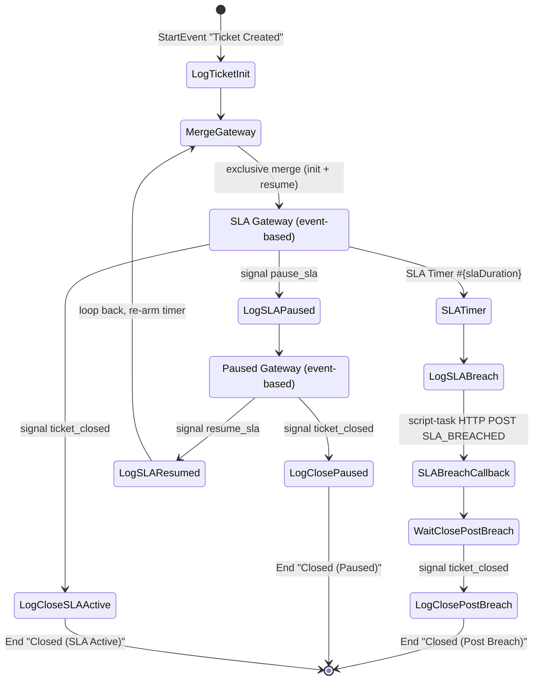

# Ticket Lifecycle Workflow (jBPM / BPMN)

This document describes how the IT-service ticketing system models the **ticket
lifecycle** as an executable **BPMN 2.0 process** running on a jBPM **KIE Server**,
and how the Spring Boot backend integrates with it.

## Why model the lifecycle as a BPMN process?

A ticket is fundamentally a **long-running, stateful, event-driven** entity: it
sits idle waiting for an SLA deadline, can be paused while waiting for the
customer, resumed, and finally closed — possibly hours or days after it was
created. Encoding that behaviour as imperative Java scattered across services
makes the state machine implicit and hard to reason about.

Modelling it as a BPMN process gives:

- **An explicit, visual state machine.** The `.bpmn2` file *is* the single
  source of truth for "what states can a ticket be in and how does it move
  between them".
- **A durable, managed SLA timer.** jBPM persists timers in its own database;
  an SLA deadline survives backend restarts and fires reliably without a
  custom scheduler holding the countdown.
- **Event-driven transitions via signals.** Pause / resume / close are delivered
  as named BPMN signals — the process reacts asynchronously instead of the
  backend polling.
- **Separation of concerns.** `WorkflowService` isolates the rest of the
  backend (especially `TicketService`) from all jBPM/KIE details.

The backend remains the system of record for tickets; the workflow engine is a
**collaborator** that owns the SLA timer and emits a callback when the deadline
is breached. The backend can fully function (degraded) if the KIE Server is
down — see *Resilience* below.

---

## Process Identity

| Property | Value |
|---|---|
| KIE Server image | custom `kie-server` image built from `Dockerfile-kie` on base `jboss/jbpm-server-full:7.61.0.Final` (jBPM 7.61, WildFly; bundles **Business Central + KIE Server + controller**, managed mode) |
| `kie-server-client` (backend) | `7.61.0.Final` — deliberately aligned with the server version |
| KIE Server id (controller server template) | `ticket-kie-server` |
| Container id (KIE deployment unit) | `ticket-workflow` |
| Process id | `com.ticketsystem.workflow.ticket-lifecycle` |
| Process name | `Ticket Lifecycle Process` |
| kjar artifact | `com.ticketsystem:ticket-workflow-kjar:1.0.5` (`packaging=kjar`) |
| BPMN source | `ticket-workflow-kjar/src/main/resources/com/ticketsystem/ticket_workflow_kjar/Ticket Lifecycle Process.bpmn` (Business Central-authored; same process id) |
| Business Central | `http://localhost:8180/business-central` (`wbadmin` / `wbadmin`) |
| KIE Server REST base | `http://kie-server:8080/kie-server/services/rest/server` (host: `http://localhost:8180/...`, `kieserver` / `kieserver1!`) |
| KIE Server Swagger UI | `http://localhost:8180/kie-server/docs` |
| Process history / state store | **file-based H2** inside the image, persisted to the `jbpm_data` Docker volume (`/opt/jboss/wildfly/standalone/data`); there is **no** separate `jbpm-db` Postgres container any more. Process + timer state survives a restart as long as the volume is kept |

The kjar carries two descriptors under `src/main/resources/META-INF/`:

- **`kmodule.xml`** — empty `<kmodule>`; the default KieBase/KieSession auto-scan
  every `.bpmn2` under `src/main/resources`.
- **`kie-deployment-descriptor.xml`** — declares JPA persistence
  (`org.jbpm.domain`), `audit-mode=JPA`, and
  **`runtime-strategy=PER_PROCESS_INSTANCE`**. (`SINGLETON` previously shared one
  ksession across all instances; orphaned SLA timers firing at startup contended
  on it and failed container creation — see commit `02a2bfd`. The `kjar-deploy`
  controller payload also pins `PER_PROCESS_INSTANCE`, and that overrides the
  descriptor.) No work-item handlers are registered — the SLA-breach callback is
  now a plain **script task** that opens an `HttpURLConnection` itself (see below),
  so the old `Rest` / `RESTWorkItemHandler` registration is gone.

---

## Process Model

The process runs **two parallel branches** that share the same process instance:

1. **State branch** — the **authoritative state machine** for the ticket. Each
   ticket status (`NEW`, `IN_PROGRESS`, `WAITING_FOR_CUSTOMER`, `RESOLVED`,
   `CLOSED`) is an explicit wait node. Backend signals `transition_<TARGET>` to
   move from one state to another; **only the source state's wait node listens
   for the signal**, so invalid transitions are silently ignored by the engine.
   Valid transitions are therefore encoded by the BPMN graph itself rather than
   by a Java map. Reaching `CLOSED` triggers a **terminate end event** that
   stops the entire process (including the SLA branch).

2. **SLA branch** — the event-based flow around the SLA timer. Waits for
   whichever happens first: the SLA timer expiring, a `pause_sla` signal,
   or a `ticket_closed` signal. Kept for the existing pause/resume side-effects
   in `TicketCommandService`.

After *"Log Ticket Init"* the *"Split"* parallel gateway forks execution into
the two branches above.

**Converging gateways.** jBPM allows a script task / catch event to have only
**one** incoming connection. Wherever several source states funnel into the
same target — `IN_PROGRESS` (reachable from `NEW`, `WAITING_FOR_CUSTOMER`,
`RESOLVED`), `CLOSED` (reachable from all four), and the loop back to `NEW` —
a converging **exclusive gateway** (*"IN_PROGRESS Merge"*, *"CLOSED Merge"*,
*"NEW Merge"*; the SLA branch resume-loop uses *"SLA Merge"*) collects the
incoming flows before the single shared script task. Exclusive gateways are the
only node type allowed to have multiple incoming connections.

**Deployment.** The kjar is compiled from source (Java 8) and baked into the
KIE image's Maven repository (`Dockerfile-kie`); a one-shot `kjar-deploy` compose
service registers the `ticket-workflow` container once the server is healthy, so
`docker compose up` needs no manual deploy step. On the compose path it registers
through the **Business Central controller management API**
(`PUT /business-central/rest/controller/management/servers/<template>/containers/<id>`);
the k8s path registers directly through the **KIE Server containers REST API**.
Both are **idempotent**: the compose script first checks whether the container is
already registered and, if so, just forces it to `STARTED`; the k8s script treats
an `already exists` response as success. See
[RUNBOOK.md](../RUNBOOK.md) → *KIE Server kjar redeploy*.

### Nodes (as defined in `Ticket Lifecycle Process.bpmn`)

> The model was re-authored in Business Central (commit `e1a51a6`), so the node
> **ids** are now opaque GUIDs — nodes are listed below by their **name**.

**Start event**

- *"Ticket Created"* — fires when the backend starts a process instance for a
  newly created ticket.

**Script tasks** (each writes a `System.out.println` log line on the KIE Server,
except *SLA Breach Callback* which performs the HTTP callback)

- *"Log Ticket Init"*
- *"LOG SLA Breach"* and *"SLA Breach Callback"* (the callback itself — see below)
- *"Log SLA Paused"* / *"Log SLA Resumed"*
- *"Log Close (SLA Active)"* / *"Log Close (Paused)"* / *"Log Close Post Breach"*
- State-log tasks: *"Log to NEW"*, *"Log to IN_PROGRESS"*, *"Log to WAITING"*,
  *"Log to RESOLVED"*, *"Log to CLOSED"*

**Gateways**

- *"Split"* — **parallel** diverging gateway; forks the process into the state
  branch and the SLA branch (see *Process Model* above).
- *"NEW Merge"*, *"IN_PROGRESS Merge"*, *"CLOSED Merge"*, *"SLA Merge"* —
  converging **exclusive** gateways collecting the multiple flows that funnel
  into a shared node (a jBPM script task / catch event allows only one incoming
  connection).
- *"State: NEW"*, *"State: IN_PROGRESS"*, *"State: WAITING_FOR_CUSTOMER"*,
  *"State: RESOLVED"* — **event-based** gateways that are the wait nodes of the
  state machine; each listens only for the `transition_<TARGET>` signals valid
  from that state.
- *"SLA Gateway"* — **event-based** diverging gateway; waits for the SLA timer,
  `pause_sla`, or `ticket_closed`.
- *"Paused Gateway"* — **event-based** diverging gateway; while paused, waits for
  `resume_sla` or `ticket_closed`.

**Timer (intermediate catch event)**

- *"SLA Timer"* — `timeDuration = #{slaDuration}` (ISO-8601 duration resolved
  from the `slaDuration` process variable, so each ticket gets a deadline derived
  from its priority).

**Signal intermediate catch events** — `transition_<TARGET>` signals on the state
branch plus `pause_sla` / `resume_sla` / `ticket_closed` on the SLA branch (the
*"Close …"* catches consume `ticket_closed` from the SLA-active, paused, and
post-breach states respectively).

**SLA-breach callback (script task, not a REST work item)**

- *"SLA Breach Callback"* — a plain BPMN **script task**. After the timer fires
  it opens a `java.net.HttpURLConnection` and sends an HTTP **POST** to the
  `callbackUrl` process variable with `Content-Type: application/json`, an
  `X-Internal-Token` header read from the KIE Server env
  (`System.getenv("JBPM_KIE_SERVER_CALLBACK_TOKEN")`), 5 s connect/read timeouts,
  and body:
  ```json
  {"ticketId": <ticketId>, "eventType": "SLA_BREACHED",
   "processInstanceId": <piId>, "additionalData": "Priority: <priority>"}
  ```
  Exceptions are caught and logged so a callback failure does not block the
  process. (Previously this was a `drools:taskName="Rest"` service task handled
  by `RESTWorkItemHandler` with the token appended to the URL — see commit
  `c8ab794` for why the token moved to the header / KIE env.)

**End events**

- The SLA branch ends at *terminate*/end events when the ticket closes from the
  SLA-active, paused, or post-breach state; one is named *"Closed"*. Reaching
  `CLOSED` on the state branch fires a **terminate end event** that stops the
  entire process (including the SLA branch).

### Signals declared

**State branch — transition signals (`transition_<TARGET>`):**

| Signal name | Sent by backend via |
|---|---|
| `transition_NEW` | `WorkflowService.requestStatusTransition(ticket, TicketStatus.NEW)` |
| `transition_IN_PROGRESS` | `WorkflowService.requestStatusTransition(ticket, TicketStatus.IN_PROGRESS)` |
| `transition_WAITING_FOR_CUSTOMER` | `WorkflowService.requestStatusTransition(ticket, TicketStatus.WAITING_FOR_CUSTOMER)` |
| `transition_RESOLVED` | `WorkflowService.requestStatusTransition(ticket, TicketStatus.RESOLVED)` |
| `transition_CLOSED` | `WorkflowService.requestStatusTransition(ticket, TicketStatus.CLOSED)` |

(`requestStatusTransition` takes a `TicketStatus` enum, since status, priority and
comment type are modelled as enums in the backend.)

The receiving state node decides whether the signal is accepted — e.g. the
*"State: NEW"* node listens only for `transition_IN_PROGRESS` and
`transition_CLOSED`, so a `transition_RESOLVED` arriving while the ticket is
in `NEW` is dropped by the engine. There is **no parallel Java map** of valid
transitions; the BPMN diagram is the single source of truth.

`TicketCommandService.validateStateTransition` realises this by signalling the
BPMN with `transition_<TARGET>` and immediately reading the process variable back
via `WorkflowService.verifyTransitionApplied`. If the variable did not advance
to the requested target (signal silently dropped → invalid transition) the
service throws HTTP `400`. If KIE Server is unreachable the verify call also
returns `false`, surfacing as a `400` to the caller — the workflow engine is
treated as a hard dependency for status transitions.

**Terminal CLOSED is confirmed via process completion.** `CLOSED` is the only
terminal target: the BPMN sets `status=CLOSED` and then fires a terminate end
event, so the process **completes** and its `status` variable is no longer
readable (reads back `null`). A naive value check would therefore give a false
negative and wrongly reject the close with `400`. `verifyTransitionApplied`
special-cases this: when the target is `CLOSED` and the variable is `null`, it
confirms the transition via `KieServerAdapter.isProcessFinished()` (process
state `COMPLETED`=2 or `ABORTED`=3) instead of the now-gone variable. A
**non-null** mismatch still means the signal was genuinely dropped and is
rejected without consulting completion.

**Stale `processInstanceId` is tolerated.** If the transition cannot be
confirmed *and* the BPMN process instance no longer exists on the KIE Server
(e.g. the jBPM history store was reset while the ticket survived in `ticketdb`),
there is no state machine left to consult. `TicketCommandService` then checks
`WorkflowService.isProcessInstanceMissing()` (which confirms a KIE **404** via
`KieServerAdapter.isProcessInstanceMissing()`) and **accepts the DB-side
transition** rather than blocking the ticket forever — the same handling as the
"no workflow attached" case. A transient outage (breaker open / connectivity)
is *not* treated as missing, so it still surfaces as a `400`.

The BPMN is authoritative for **all** status changes, not only explicit
user-initiated transitions. (The generic `PUT /tickets/{id}/status` was replaced
by guarded action endpoints — `/wait`, `/resume`, `/resolve`, `/reopen`, `/close`
— in commit `55caab1`; each action drives the status within its own guard and
`NEW`↔`IN_PROGRESS` is claim/unclaim-only.) The
**side-effect** transitions caused by claim / unclaim / assign also drive the
BPMN: `syncTicketStatus` / `syncTicketAssignment` send the same
`transition_<STATUS>` signal (see *Status & assignment sync* below), so a claim
or assign advancing `NEW` → `IN_PROGRESS` and an unclaim of the last claim
moving `IN_PROGRESS` → `NEW` keep the BPMN state node and the DB consistent.

**SLA branch — lifecycle signals:**

| Signal name | Sent by backend via |
|---|---|
| `pause_sla` | `WorkflowService.pauseSla()` |
| `resume_sla` | `WorkflowService.resumeSla()` |
| `ticket_closed` | (not sent during normal close — see note) |

> **Note on `ticket_closed`:** The state-machine branch reaches CLOSED via
> `transition_CLOSED`, whose *"Closed"* end event is a **terminate** event that
> ends the *entire* process instance (the parallel SLA branch token included).
> Because `transition_CLOSED` is already sent during the transition validation,
> the close flow no longer sends a separate `ticket_closed` signal — doing so
> would always hit an already-terminated instance and return HTTP 404. The
> `Close (SLA Active)/Close (Paused)/Close Post Breach` catch events that listen
> for `ticket_closed` remain in the BPMN but are unreachable in practice.

### Flow walk-through

1. **Start → Init → Split → SLA Merge → SLA Gateway.** A new ticket starts the
   process; *"Log Ticket Init"* logs it; the *"Split"* parallel gateway forks the
   state and SLA branches; on the SLA branch control reaches the *"SLA Merge"*
   exclusive gateway and then the event-based *"SLA Gateway"*.
2. **SLA Gateway** waits for the first of three events:
   - **Timer fires** → *"LOG SLA Breach"* → *"SLA Breach Callback"* (POSTs
     `SLA_BREACHED` to the backend) → wait for `ticket_closed`. When it arrives →
     *"Log Close Post Breach"* → end.
   - **`pause_sla`** → *"Log SLA Paused"* → *"Paused Gateway"*.
   - **`ticket_closed`** → *"Log Close (SLA Active)"* → end.
3. **Paused Gateway** waits for the first of two events:
   - **`resume_sla`** → *"Log SLA Resumed"* → loops back into the *"SLA Merge"*
     gateway, re-entering the SLA Gateway and re-arming the timer with the
     *remaining* `slaDuration`.
   - **`ticket_closed`** → *"Log Close (Paused)"* → end.

Pause/resume can repeat any number of times. The timer is re-created each time
the SLA Gateway is re-entered, so the SLA "clock" is effectively suspended while
the ticket is in the paused branch.

### Diagram



> The diagram above shows the **SLA branch** only (init → SLA Gateway → pause /
> resume / breach / close), which is the part the timer and lifecycle signals
> drive. It is a simplified view of the re-authored model: the actual `.bpmn`
> also runs the parallel **state branch** (the `State: <STATUS>` event-based
> gateways) off the *"Split"* gateway, and the SLA-breach callback is now a
> script task rather than a REST task. The node names above are the source of
> truth for the current model.

---

## Process Variables

All variables are typed `String` (`itemDefinition structureRef="String"`).

| Variable | Direction | Set by | Purpose |
|---|---|---|---|
| `ticketId` | in | `startTicketWorkflow()` | Ticket primary key; echoed in the SLA-breach callback body. |
| `priority` | in | `startTicketWorkflow()` | Ticket priority; drives the SLA duration and is included in `additionalData`. |
| `customerId` | in | `startTicketWorkflow()` | Customer who raised the ticket. |
| `status` | in / updated | `startTicketWorkflow()` (seed); advanced by `syncTicketStatus()` / `syncTicketAssignment()` via the `transition_<STATUS>` signal | Current ticket status. The sync methods drive the BPMN with a transition signal (not a raw variable write) so the state node actually advances. |
| `assigneeId` | updated | `syncTicketAssignment()` | Id of the agent who last claimed the ticket. |
| `slaDuration` | in / updated | `startTicketWorkflow()`, `resumeSla()` | ISO-8601 duration (e.g. `PT30M`, `PT1H30M`) used by the *"SLA Timer"*. On resume it is rewritten to the *remaining* time. |
| `callbackUrl` | in | `startTicketWorkflow()` | Backend internal callback URL **only** — the base URL, **without** any token (`callbackBaseUrl`). The *"SLA Breach Callback"* script task adds the token as the `X-Internal-Token` header, read from the KIE Server env, so the secret no longer lands in the process variables / jBPM store / logs (commit `c8ab794`). |
| `processInstanceId` | engine-provided | jBPM runtime | Read from `kcontext` inside the callback script and included in the callback body; the backend persists the returned instance id on the `Ticket` entity. |

`startTicketWorkflow()` seeds `ticketId`, `priority`, `customerId`, `status`,
`slaDuration`, `callbackUrl`. New tickets always start in status `NEW` (no claim
information yet).

---

## Backend → KIE integration

### Wiring

- **`KieClientConfig`** builds the shared `KieServicesClient` bean
  (`KieServicesFactory.newRestConfiguration(url, username, password)`,
  `MarshallingFormat.JSON`, configurable timeout, default 30 s). On startup it
  pings `getServerInfo()`; a failed ping is logged but the application still
  starts (workflow features simply degrade). It also defines the
  `kieServerCircuitBreaker` bean.
- **`KieServerAdapter`** is the single place that touches the KIE client. From
  `KieServicesClient` it derives `ProcessServicesClient`, `QueryServicesClient`,
  `UserTaskServicesClient`, and `ProcessAdminServicesClient`. Every call is
  wrapped in the Resilience4j circuit breaker.
- **`WorkflowService`** is the business-facing layer; it converts ticket data
  into process variables and delegates to `KieServerAdapter`. It keeps
  `TicketService` free of jBPM details.

Connection settings come from `jbpm.kie-server.*` in `application.yml` (env vars
`JBPM_KIE_SERVER_URL/USERNAME/PASSWORD/CONTAINER_ID/PROCESS_ID/TIMEOUT/CALLBACK_TOKEN/CALLBACK_BASE_URL`).

### Starting a process

`TicketService` publishes a `TicketCreatedEvent`. `WorkflowEventListener`
handles it with `@TransactionalEventListener(AFTER_COMMIT)` +
`@Transactional(REQUIRES_NEW)` — the process is only started **after** the
ticket commit succeeds, in a fresh transaction:

1. `WorkflowService.startTicketWorkflow(ticket)` builds the process variable map
   (including `slaDuration` from `SlaPolicyService.getSlaDurationMs(priority)`
   converted to ISO-8601 via `msToIsoDuration()`, and `callbackUrl` with the
   token appended).
2. `KieServerAdapter.startProcess(processId, variables)` →
   `processClient.startProcess("ticket-workflow", processId, variables)`.
3. The returned `processInstanceId` is written back onto the `Ticket` entity
   (`ticket.setProcessInstanceId(...)`). If the start fails the ticket still
   exists — the failure is logged, not propagated.

### Status & assignment sync

Both methods **drive the BPMN state machine** via
`requestStatusTransition(ticket, ticket.getStatus())` — i.e. they send the
`transition_<STATUS>` signal. A raw `setProcessVariable(pid, "status", ...)`
write does **not** advance the process token to the matching state node, so the
BPMN would stay on the previous state and silently drop later transitions.

- `syncTicketStatus(ticket)` → `requestStatusTransition(ticket, status)`.
- `syncTicketAssignment(ticket, agentId)` →
  `setProcessVariable(pid, "assigneeId", agentId)` (plain variable) **and**
  `requestStatusTransition(ticket, status)` to advance the state node.

This is what makes the side-effect transitions actually move the BPMN: a claim
or assign auto-promotes `NEW` → `IN_PROGRESS`, and unclaiming the last claim
moves `IN_PROGRESS` → `NEW`. Both no-op (with a warning) if the ticket has no
`processInstanceId`.

### SLA pause / resume / close signals

| Operation | What `WorkflowService` does | KIE call |
|---|---|---|
| `pauseSla(ticket)` | Accumulates elapsed SLA time into `slaElapsedMs`, sets `slaPausedAt`; idempotent if already paused. | `signalProcessInstance(pid, "pause_sla", null)` |
| `resumeSla(ticket)` | Clears `slaPausedAt`, sets `slaResumedAt`, computes remaining time, writes `slaDuration`. Also projects `slaDeadline` forward to `slaResumedAt + (getSlaDurationMs(priority) - slaElapsedMs)` so the active badge and the SLA breach scheduler count only active time and do not lose time spent paused. | `setProcessVariable(pid, "slaDuration", remaining)` then `signalProcessInstance(pid, "resume_sla", remaining)` |
| `closeTicketWorkflow(ticket)` | Sends `ticket_closed` (fallback `abortProcess`). **No longer called by the close lifecycle** — `transition_CLOSED`'s terminate end event already ends the whole instance. Kept for explicit/standalone use; covered by its own unit tests. | `signalProcessInstance(pid, "ticket_closed", null)`; **fallback** to `abortProcess(pid)` if the signal throws |
| `abortTicketWorkflow(ticket)` | Hard-cancels the process for a deleted/cancelled ticket. | `abortProcess(pid)` |

`getActiveTimerDeadline(pid)` uses `ProcessAdminServicesClient.getTimerInstances`
to read the next fire time of the live SLA timer (a single timer is expected per
instance). `getSlaTimerInfo(ticket)` computes a client-facing `slaState` of
`active | paused | expired | completed` from the ticket's own fields (it does
not call KIE). Its **paused** branch derives remaining as
`getSlaDurationMs(priority) - slaElapsedMs` (deterministic in-memory config, no
flicker) rather than `slaDeadline - createdAt`; because `slaElapsedMs` only
accumulates active time, this value stays frozen while paused.

---

## KIE → Backend callback

When the *"SLA Timer"* fires, the *"SLA Breach Callback"* script task POSTs to
the backend.

- **Endpoint:** `POST /api/v1/internal/workflow/callback`
  (`WorkflowCallbackController`, base path `/api/v1/internal/workflow`).
- **Auth:** the endpoint is under `/api/v1/internal/**`, which **bypasses JWT**.
  The callback script task sends the token as an `X-Internal-Token` **header**
  (read from the KIE Server env `JBPM_KIE_SERVER_CALLBACK_TOKEN`); the `callbackUrl`
  process variable carries only the base URL with no token. The controller
  validates the header against `jbpm.kie-server.callback-token`. Comparison is
  **constant-time** (`MessageDigest.isEqual`) to avoid timing attacks. A
  missing/wrong token → `401`.
- **Payload:** `WorkflowCallbackDTO` — `ticketId` (required), `eventType`
  (required: `SLA_BREACHED` | `PROCESS_COMPLETED`), `processInstanceId`,
  `additionalData`.
- **Handling:**
  - `SLA_BREACHED` → `handleSlaBreach()`: sets `ticket.slaBreached = true`,
    saves, and calls `NotificationService.notifySlaBreached(ticket)`. It is
    **idempotent** — if `slaBreached` is already `true` the callback is skipped,
    so a jBPM retry (or a race with the SLA scheduler) cannot double-send mail.
  - `PROCESS_COMPLETED` → informational log only.
  - unknown `eventType` → `400`.
  - unknown `ticketId` → `404`.

> Note: the callback token is sent **only** as the `X-Internal-Token` header
> (commit `c8ab794`). It is no longer appended to the callback URL, so the shared
> secret does not leak into the jBPM store or KIE Server logs.

---

## Resilience

KIE Server is treated as a **non-critical dependency**: ticket operations must
not fail just because the workflow engine is unavailable.

**Resilience4j circuit breaker** (`kieServerCircuitBreaker`, name `kieServer`,
in `KieClientConfig`) wraps every `KieServerAdapter` call:

| Setting | Value |
|---|---|
| Failure-rate threshold | 50 % |
| Sliding window size | 10 calls |
| Minimum number of calls | 5 |
| Wait duration in open state | 30 s |
| Permitted calls in half-open state | 3 |
| Slow-call duration threshold | 10 s |
| Slow-call rate threshold | 50 % |

A **"process instance not found" (HTTP 404)** is explicitly **ignored** by the
breaker (`ignoreException(KieClientConfig::isProcessInstanceNotFound)`, matched
on the `Could not find process instance` message). A 404 is a deterministic
per-instance outcome — the instance is permanently gone (completed & pruned, or
the history store was reset), not a sign the KIE Server is unhealthy — so it
must not count toward the failure rate and trip the breaker for every other
ticket. Genuine connectivity failures (timeouts, refused connections, 5xx)
carry a different message and are still recorded.

State transitions are logged via the circuit breaker's event publisher.

**Graceful degradation strategy:**

- *Read / fire-and-forget calls* (`setProcessVariable`, `signalProcessInstance`,
  `abortProcess`, `getProcessInstance`, `getActiveTimerDeadline`,
  `getActiveTasks`, `isProcessFinished`, `isProcessInstanceMissing`) — when the
  breaker is **open** (`CallNotPermittedException`) or the call fails, the
  adapter **logs and returns null / empty / false / void**. The ticket operation
  proceeds; the DB stays consistent even if jBPM drifts. `isProcessFinished` and
  `isProcessInstanceMissing` deliberately return `false` when they cannot reach
  the server, keeping callers conservative (only a *confirmed* terminal/missing
  state changes behaviour).
- *Critical calls* (`startProcess`, `claimAndCompleteTask`) — rethrow a
  `RuntimeException`. For `startProcess`, `WorkflowEventListener` catches it:
  the ticket already exists, only the workflow link is missing, and that is
  logged rather than failing the request.
- `closeTicketWorkflow` has an extra safety net: if the `ticket_closed` signal
  throws, it falls back to `abortProcess` so no orphaned process instance is
  left running. It is no longer invoked by the normal close flow (the
  `transition_CLOSED` terminate end event handles full cleanup); it remains for
  explicit/standalone termination.
- The startup ping in `KieClientConfig` never aborts boot — the backend starts
  even if KIE Server is down.

---

## Deployment

### Building the kjar

`ticket-workflow-kjar` is a Maven module with `packaging=kjar`, built by the
`kie-maven-plugin` (`7.61.0.Final`). Its `pom.xml` pins `kie.version` to
`7.61.0.Final` to match the running KIE Server.

> The kjar must be compiled with **Java 8**: `kie-maven-plugin 7.61.0.Final`
> references `java.lang.Compiler`, which was removed in Java 9. `Dockerfile-kie`
> handles this with a multi-stage build (`maven:3.8.7-eclipse-temurin-8`),
> independent of the host JDK.

> The kjar is also now **built and pushed as part of CD** — the `cd.yml`
> workflow builds the `kie-server` image from `Dockerfile-kie` and pushes it to
> Docker Hub on a successful release, and overrides the `kie-server` kustomize
> image (commit `948772a`). The dev/compose path still rebuilds it locally.

### Compose (default path)

- `kie-server` builds from `Dockerfile-kie` on base
  **`jboss/jbpm-server-full:7.61.0.Final`** (the full jBPM server — bundles
  Business Central + the KIE controller + KIE Server). The
  `com.ticketsystem:ticket-workflow-kjar:1.0.5` artifact (jar **and** `.pom`) is
  **baked into the image's Maven repository** at
  `/opt/jboss/.m2/repository/com/ticketsystem/ticket-workflow-kjar/1.0.5/` —
  there is **no** `~/.m2/repository` host mount (an empty mount would shadow the
  baked kjar). The kjar is compiled in a Java 8 build stage (see below).
- A one-shot **`kjar-deploy`** compose service (a small `curl` container) waits
  for the server to be healthy, then registers the **`ticket-workflow`** container
  through the **Business Central controller management API**
  (`PUT /business-central/rest/controller/management/servers/ticket-kie-server/containers/ticket-workflow`)
  with the artifact's release id and `runtimeStrategy=PER_PROCESS_INSTANCE`. The
  process `com.ticketsystem.workflow.ticket-lifecycle` then becomes available over
  the KIE REST API. The backend `depends_on` this service completing successfully,
  so `docker compose up` needs no manual deploy step. Registration is
  **idempotent** — the script first checks whether the container already exists
  and, if so, just forces it to `STARTED`; then it polls the KIE Server containers
  endpoint until the container reports `STARTED`.
- **Process state** is stored in the image's default **file-based H2**, persisted
  to the **`jbpm_data`** Docker volume (mounted at
  `/opt/jboss/wildfly/standalone/data`); Business Central projects + controller
  state live in the **`jbpm_niogit`** volume. In-flight instances survive a
  restart as long as those volumes are kept. There is **no separate `jbpm-db`
  Postgres container** any more (removed in commit `a5cbf11`), and the old
  PostgreSQL datasource wiring — the `jbpm-postgres-ds.cli` jboss-cli batch and
  the `kie/modules/.../postgresql` WildFly module — has been deleted along with it.
  The volume mount points (`.niogit`, `standalone/data`) are pre-created with
  `jboss` ownership in `Dockerfile-kie` so empty named volumes initialize
  writable, removing the need for a separate chown-init step.
- `make rebuild` (`docker compose up -d --build`) rebuilds and restarts the
  stack after kjar changes.

### Kubernetes (alternative path)

- There is no `~/.m2` mount in-cluster, so `Dockerfile-kie` **bakes the kjar
  (and its `.pom`) into the KIE Server image's Maven repository** at
  `/opt/jboss/.m2/repository/com/ticketsystem/ticket-workflow-kjar/1.0.5/`.
- `k8s/base/workflow/kjar-deploy-job.yaml` is a one-shot `Job` that waits for
  the KIE Server to be ready, then `PUT`s the `ticket-workflow` container with
  the `com.ticketsystem:ticket-workflow-kjar:1.0.5` release id **directly via the
  KIE Server containers REST API** (not the Business Central controller used on
  the compose path). It is **idempotent** — a `SUCCESS` or `already exists`
  response is treated as success.
- The k8s `kie-server` deployment sets `JAVA_OPTS` to the image's **in-memory H2**
  store (`ExampleDS` + `H2Dialect`). So under k8s, container registration is lost
  on restart — `make k8s-redeploy-kjar` deletes and re-creates the `kjar-deploy`
  job to re-register it.

### Changing the process

Editing `Ticket Lifecycle Process.bpmn` (or any kjar content) requires
**rebuilding and redeploying the kjar** to the KIE Server — the running container
does not hot-reload BPMN definitions. In dev the simplest path is `make rebuild`
after changing anything under `ticket-workflow-kjar/`. Bump the kjar `version` if
you want the KIE Server to treat it as a new release. The model can also be edited
in the bundled **Business Central** UI (`http://localhost:8180/business-central`),
which is how the current `.bpmn` was authored (commit `e1a51a6`).

---

## File reference

| Concern | Path |
|---|---|
| BPMN process model | `ticket-workflow-kjar/src/main/resources/com/ticketsystem/ticket_workflow_kjar/Ticket Lifecycle Process.bpmn` |
| kjar module descriptor | `ticket-workflow-kjar/src/main/resources/META-INF/kmodule.xml` |
| kjar deployment descriptor | `ticket-workflow-kjar/src/main/resources/META-INF/kie-deployment-descriptor.xml` |
| kjar Maven module | `ticket-workflow-kjar/pom.xml` |
| KIE client + circuit breaker beans | `it-service-backend/.../config/KieClientConfig.java` |
| KIE REST adapter | `it-service-backend/.../service/KieServerAdapter.java` |
| Workflow business layer | `it-service-backend/.../service/WorkflowService.java` |
| Process-start event listener | `it-service-backend/.../event/WorkflowEventListener.java` |
| SLA-breach callback endpoint | `it-service-backend/.../controller/WorkflowCallbackController.java` |
| Callback payload DTO | `it-service-backend/.../dto/WorkflowCallbackDTO.java` |
| Status transition logic | `it-service-backend/.../service/TicketCommandService.java` |
| KIE Server + `kjar-deploy` services (compose) | `docker-compose.yaml` |
| Custom KIE Server image (compose + k8s) | `Dockerfile-kie` |
| CD build/push of the kie-server image | `.github/workflows/cd.yml` |
| kjar registration Job + KIE Server deployment (k8s) | `k8s/base/workflow/kjar-deploy-job.yaml`, `k8s/base/workflow/kie-server-deployment.yaml` |
</content>
</invoke>
